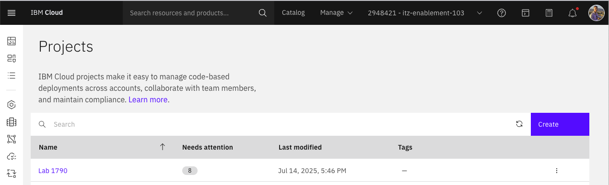

# Part 1: Getting Situated

Before we begin analyzing cost and sustainability metrics, it’s essential to understand the environment that has been provisioned. In this section, you’ll explore the deployed resources on IBM Cloud, verify the configuration of the OpenShift (ROKS) cluster, identify the applications running, and confirm that IBM Cloud Monitoring is active and collecting data. This baseline will provide the necessary context for the optimization work to come.

## Log in to IBM Cloud

1. Go to [https://ibm.biz/1970-login](https://ibm.biz/1970-login) in your browser.
1. Enter the `Username` and `Password` provided for the lab.
1. Click **Sign in**.
  
1. You are now logged in IBM Cloud.
  

## View Project that Deployed ROKS

1. From the IBM Cloud dashboard, open **Projects**

1. Click on the `Lab 1790` project used to deploy the cluster and other resources for the lab.

1. Click on the `Configurations` tab and the click on the overflow menu (three dots) next to the "cluster-and-monitoring" configuration.  Select Edit

1. Review the deployment configuration to understand the components provisioned—such as the Red Hat OpenShift cluster, VPC networking, monitoring.  Open the inputs section to find important details like the worker machine type and number of workers per pool.  You can also click on the "optional inputs" toggle to see additional configuration options.

1. Take note of the number of pool workers per zone, the number of zones, and the pool machine type as these inputs have a big impact on the size and cost of the cluster.
1. This configuration is based on a reusable deployable architecture for [Red Hat OpenShift on IBM Cloud VPC infrastructure](https://cloud.ibm.com/catalog/7a4d68b4-cf8b-40cd-a3d1-f49aff526eb3/architecture/deploy-arch-ibm-ocp-vpc-1728a4fd-f561-4cf9-82ef-2b1eeb5da1a8-global) which is a great way to deploy a secure cluster.

## Survey account via the Resource List

1. Open the **Resource List** from the IBM Cloud main menu (top left in the header)

1. Open up the containers, network, storage, and observability categories

1. Identify key resources deployed for the lab, including:
    - The OpenShift cluster
    - VPC and associated subnets
    - Load balancers and block storage
    - IBM Cloud Monitoring instance
1. This gives a quick inventory of all cloud assets tied to the environment.

## View Cluster Configuration via Service Details

1. Click on the **Lab1790-openshift** cluster in the resource list to view the cluster details, including:
    - Cluster version and status
    - Number of worker nodes
    - Worker node types (e.g., `bx2.8x32`)
    - Node pools and zones
    - Autoscaling or high availability configurations (if present)

1. Understanding these details helps in identifying opportunities for cost optimization or right-sizing.  These details should match the project configuration we viewed earlier.
1. Finally, take note of the Cluster ID displayed in the cluster details `d1qnn2ud0c1g6mtpkpbg` as we will use that ID to identify this cluster later

## Determine What Apps Are Running

1. Click the **Openshift web console** button

1. Navigate to **Deployments** to view all deployed apps and services on the cluster

1. Select the astro-shop project from the project filter at the top left to filter to only the business related apps
    - Have a look through the list to get a sense of the microservices deployed, such as e-commerce frontends, microservices, or analytics pipelines.
1. For each micro-service listed in the deployments view you can inspect the CPU and Memory limits by clicking on its name and then scrolling down to the containers section where you can see the setting for resource limits.

1. Under networking->routes observe the URL for the astro-shop front end.

1. Click through the link (you may have to click past some warnings as the Astroshop uses HTTP and not HTTPS) and view the example ecommerce application we are optimizing.

## Confirm IBM Cloud Monitoring Is Active

1. Return to the IBM Cloud resource list via the main menu

1. Find the **IBM Cloud Monitoring** instance in the `Observability` section.
1. Click on the **Dashboard** link to open the monitoring dashboard.

1. Click on Advisor -> Overview -> Clusters to view the cluster overview.

1. If you see the lab cluster id (should match the cluster id we saw earlier on the cluster service details page - `d1qnn2ud0c1g6mtpkpbg`), then you know
    - The monitoring agent is installed on the correct OpenShift cluster
    - Metrics are being collected
1. Then go to Advisor -> Overview -> Namespaces to see high level information about the various namespaces (projects) running on the cluster.  You can filter down to "astro-shop" to see only the namespace containing our business applications.

