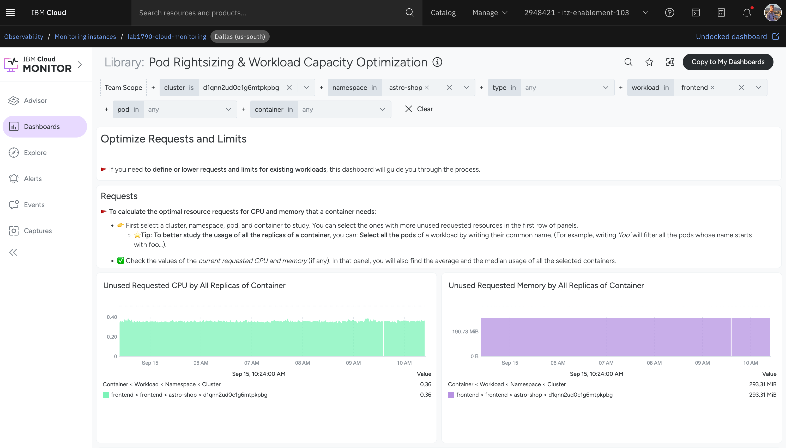
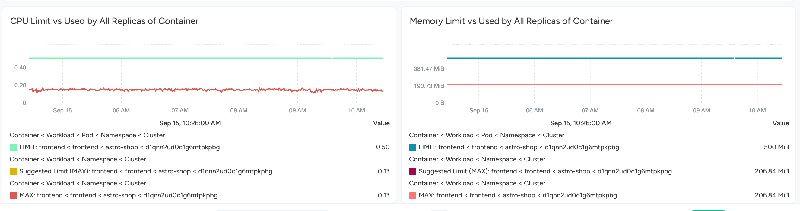
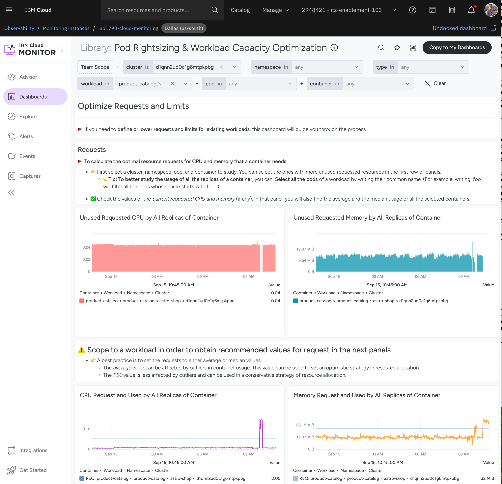
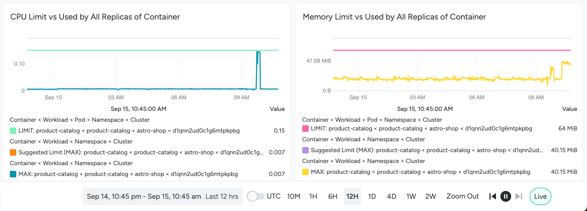

# Part 2: Determine use patterns

In this part of the lab, you’ll use IBM Cloud Monitoring (powered by Sysdig) to analyze how the deployed applications are using compute and storage resources over time. This analysis is foundational for identifying right-sizing opportunities and ensuring workloads are neither over-provisioned nor resource-constrained.

## Launch IBM Cloud Monitoring

1. From the IBM Cloud main menu (top left) select Observability->Monitoring->Instances

1. Launch the 'lab 1790' IBM Cloud Monitoring instance by clicking on the 'dashboard' link.

## Locate and Monitor the Cluster

1. Once in the Monitoring Dashboard interface, select **Advisor** - kubernetes troubleshooting from the menu on left to get a view of the kubernetes (and openshift) clusters which are being monitored.

1. Select our lab cluster based on the ID (d1qnn2ud0c1g6mtpkpbg) we found in part 1 and then click on the "astro-shop" project/namespace so that we can see the overall status of our commerce application.  The other namespaces are used by various services that secure, operate, and administer the openshift cluster - we aren't looking to optimize them at this time.

1. Explore this dashboard to see any trends or behavior of interest

## Analyze Resource Usage vs Requests and Limits

1. From the Dashboards menu on the left, select the "Pod Rightsizing & Workload Capacity" dashboard

1. Use the filters at the top to select the correct cluster and project/namespace (astro-shop).

1. Explore the information provided.  Here is where we can see how the set of microservices that make up the astro-shop are using resources relative to what the cluster is configured to provide.
1. Note any services that don't have limits defined.  Services without limits are constrained by cluster default limits which may not be appropriate for the workload.  These cluster defaults are 1CPU / 8Gi RAM unless overridden to something else.

1. Ensure the timescale (at the bottom of the page) is set to a week or two so that you are looking at sufficient data to see cpu and memory trends.

1. Step through the list of astro-shop workloads using the filters at the top.  Look for any signs of services hitting memory limits and restarting.  Find any workloads with a lot more cpu or memory requested than used (and thus wasted capacity)

1. Let's look at the "frontend" deployment - this service renders the website and acts as an API gateway.  It is clearly critical for the operation of our ecommerce application.  How much cpu and ram is it requesting?  What are the cpu and ram limits set to?  Are we using the requested amounts?  Getting near or hitting the limits?
1. Select "frontend" in the workload filter and look at the unused requested CPU and Memory

We can see that the front end is requesting a lot more resources than it typically uses - this is something to correct.
1. Look at the CPU and Memory limits vs used

We can also see that the front end doesn't seem to have very bursty traffic (but double check over a week long time frame) and isn't near to hitting its limits.  We could probably lower the limits as well, but perhaps for the front end we should leave the limits high just in case.
1. Now have a look at the "product-catalog" service.  This service is responsible for tracking inventory and which products are available.  Select "product-catalog" in the workload filter (be sure to remove "frontend" so you can focus on the single service.)

Make sure to have a 12h or 24h time window so you can see there is some spiky load on this service.  In fact it is going way over its requested CPU and Memory during these bursts of load.  Given that this load is infrequent we may not want to raise the requested amounts to cover this.
1. Look at the limits section for the service (near the bottom)

Here we can see that the bursts of load are causing the service to hit its CPU limit and get close to its RAM limit.  If we don't want to limit performance during bursts, we should raise the CPU limit and consider raising the Memory limit to avoid having the service get killed when it runs out of memory.

### Document Optimization Opportunities

While reviewing usage data:

- ✅ **Flag workloads with large gaps** between requested and actual usage.
  - These are often over-provisioned and may be good candidates for right-sizing.
- ⚠️ **Identify workloads near or exceeding limits.**
  - These may need to be scaled up or have higher limits set to avoid performance degradation or restarts.
- Optional: Take screenshots or export metrics for reference in later lab sections.

## Summary

By the end of this step, you should have a good understanding of how each application is consuming resources relative to what has been allocated. This insight is essential for the next phase: applying FinOps and GreenOps strategies to optimize resource usage and reduce waste.
