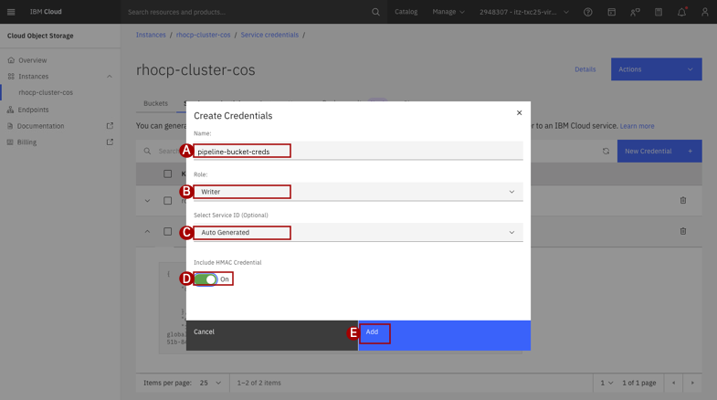
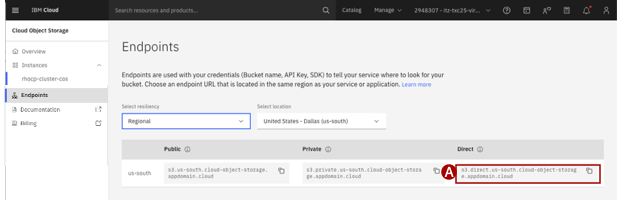

## Step 1: Create a COS bucket with credentials

Pipelines in OpenShift AI will use this COS bucket to store log files and output from the pipeline runs. We will use the existing COS instance created for the OpenShift AI cluster. However, we will create a new bucket for the data pipeline to use. For performance purposes, the bucket should be allocated in the same location that the OpenShift cluster runs in.

1. In the IBM Cloud console, navigate to the Resource List and expand the **Storage** category. Select the `openshift-ai-cos` service instance

2. Click **Create bucket** then "Create a Custom Bucket". Provide the following for the bucket configuration:
    +  **Unique-bucket-name**: `dpl4lab-bucket-XYZ` where `XYZ` is any unique set of characters
    +  **Resiliency**: `Regional`
    +  **Location**: `Brazil - Sao Paolo (br-sao)`
> Leave all other settings at their default

3. Create **Service credentials (A)** for Data Science Pipelines to store logs and output:
    +  **Name (B)**: `l4-lab-paas-pipelines`
    +  **Role (C)**: `Writer`
    +  **Servive ID (D)**: `Auto-Generate`
    +  **Include HMAC (E)**: `On`

    

    Click **Add (F)**

4. Record the credentials in the `cos_hmac_keys` section of the newly created Service credential. Specifically, you will need the value of **access_key_id (A)** and **secret_key_access (B)**. These values will be used in [Step 4](#step-4-create-a-pipeline-server) below.

5. Record the `Direct` endpoint for the COS service instance. This value will be used in [Step 4](#step-4-create-a-pipeline-server).
> The Direct endpoint can be used since the OpenShift AI cluster resides in an IBM Cloud VPC. Learn more on the COS [Endpoint Types](https://cloud.ibm.com/docs/cloud-object-storage?topic=cloud-object-storage-endpoints#advanced-endpoint-types).

    
