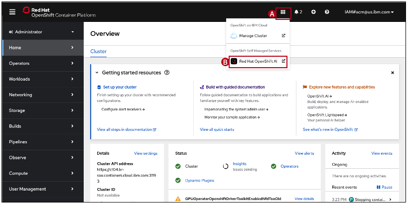

## Step 2: Open the OpenShift AI console

1. In the IBM Cloud console, navigate to the Resource List and expand the **Containers** category. Select the `l4-lab-paas-rhoai-cluster`
2. At the top of the screen, Click the **OpenShift web console** button
3. In the top navigation bar, click the **grid icon (A)** and then click **Red Hat OpenShift AI (B)**
    
