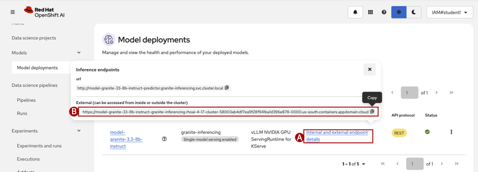

## Step 2: Open the OpenShift AI console

1. In the IBM Cloud console, navigate to the **Resource List** in the left navigation menu and expand the **Containers** category. Select the `rhoai-4.17-cluster`
2. At the top of the screen, Click the **OpenShift web console** button
3. In the top navigation bar, click the **grid icon (A)** and then click **Red Hat OpenShift AI (B)**

    

4. Open the **Model / Model Deployments (A)** menu to view the deployed models on the OpenShift AI cluster. You will need 2 bits of information to build the pipeline in a later step. Click on the **? (B)** icon under the Model Deployment name. Record the **Resource Name (C)** of the model deployed (i.e. in TextPad)
    Record:
    * **Model Resource name**: `model-granite-33-8b-instruct` (example)

    

5. In the same screen, click on the **Internal and external endpoint details (A)** link. Record the **External (B)** endpont of the model. These values will vary by the model deployed and the cluster the model is deployed on.
    Record:
    * **Inference endpoint (external)**: `https://model-granite-33-8b-instruct-aal4lab-v1.l4-lab-paas-rhoai-946464-1cce585f5a0d7ffedb5150cacf858bae-0000.br-sao.containers.appdomain.cloud` (example)

    
