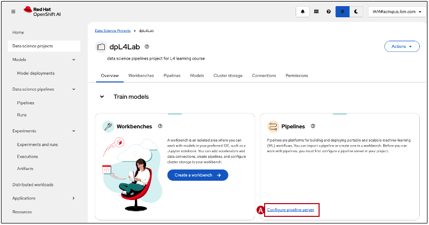
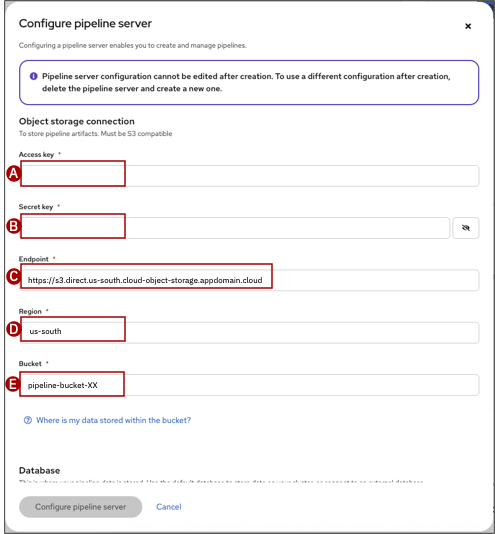

## Step 4: Create a pipeline server

Before you can create a data science pipeline, you must create a pipeline server. A pipeline server will run all pipelines in the Data science project and only needs to be created once.

1. In the Pipelines tile, click **Configure pipeline server (A)**
    

2. Configure the pipeline server with the COS bucket setup in Step 1. You might need to revisit the COS instance to get the following values:

    * **Access key (A)**: *value of "cos_hmac_keys"."access_key_id"*
    * **Secret key (B)**: *value of "cos_hmac_keys"."secret_access_key"*
    * **Endpoint (C)**: *Direct endpoint URL in the bucket settings*
    * **Region (D)**: *region where the COS bucket was provisioned*
    * **Bucket (E)**: *bucket name*

Click **Configure pipeline server**
