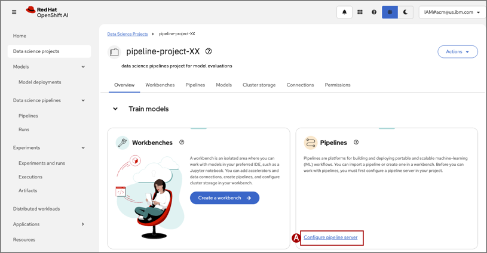

## Step 4: Create a pipeline server

Before you can create a data science pipeline, you must create a pipeline server in your Data science project. A pipeline server will run all pipelines in the Data science project and only needs to be created once.

1. In the Pipelines tile, click **Configure pipeline server (A)**
    

2. Configure the pipeline server with the COS bucket setup in [Step 1](10-create-cos-bucket.md). You might need to revisit the COS instance to get the following values:

    * **Access key (A)**: *value of "cos_hmac_keys"."access_key_id"
    * **Secret key (B)**: *value of "cos_hmac_keys"."secret_access_key"*
    * **Endpoint (C)**: *Direct endpoint URL in the bucket settings* **include `https://` at the start of the endpont**
    * **Region (D)**: `us-south` *region where the COS bucket was provisioned*
    * **Bucket (E)**: `pipeline-bucket-XX` *where `XX` is your student ID*

Click **Configure pipeline server**
