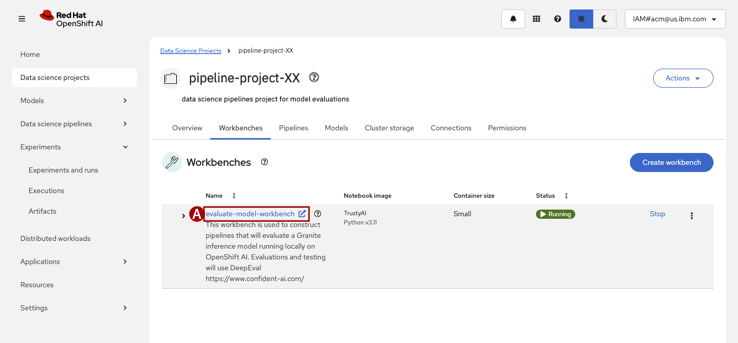

### Step 5: Create a Workbench
Workbenches are scoped to a Data science project, and you can have more than one. Workbenches are used to design and construct data science pipelines (which the Pipeline Server will run). There are different flavors of Workbench environments which have various packages and frameworks to construct pipelines. We will create a Workbench that supports [Jupyter](https://jupyter.org/) notebooks, [Python](https://www.python.org/) scripts, and the [Elyra](https://github.com/elyra-ai/elyra) AI-centric extensions for Jupyter notebooks.

1. From the `dpL4Lab` Data science project Overview tab, click on **Create a workbench (A)**
    

2. Create a workbench.
    * **Name**: `evaluate-model-workbench`
    * **Description**: `This workbench is used to construct pipelines that will evaluate a Granite inference model running locally on OpenShift AI. Evaluations and testing will use DeepEval https://www.confident-ai.com/`
    * **Image Selection**: `TrustyAI`
    * **Version selection**: `2025.1` (or the Recommended version)
  >"View package information" shows what packages will be available in the workbench environment. This lab requires Jupyter and Elyra, so any image selected that has those pacakages should suffice.

    Leave all other settings at their default

    Click **Create workbench**

3. When the workbench finishes provisioning, click the **Name (A)** to launch.

    

4. *If prompted*, click **Allow selected permissions (A)** to continue.

    

> The workbench will start with top and left hand navigations and a **Launcher** window.
