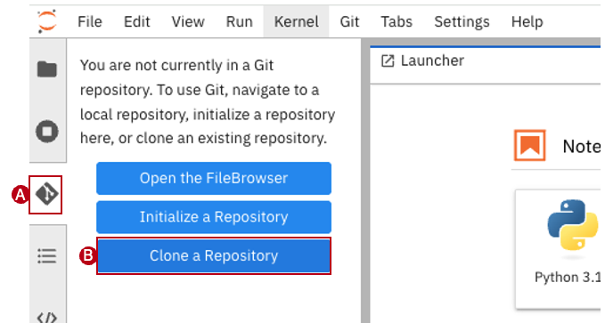
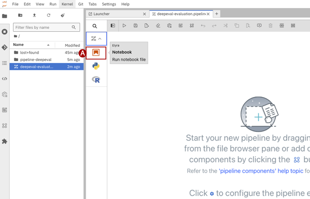
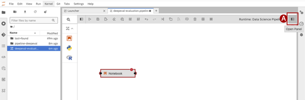
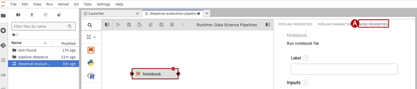
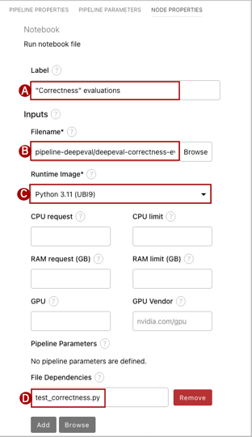
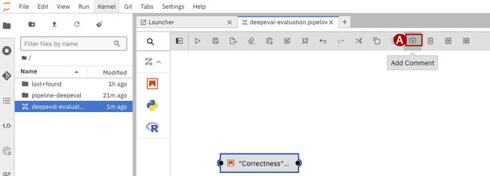
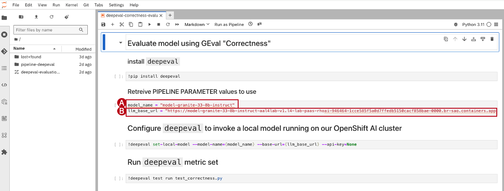
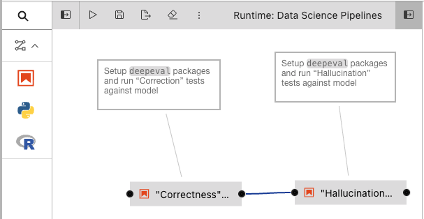

## Step 6: Create the pipeline
The workbench you see will be used to construct an AI pipeline with existing assets in a git repo configured to run deepeval test cases against the model deployed in the local Red Hat OpenShift AI cluster.

1. From the left menu, find the **git (A)** icon and **Clone a Repository (B)**, specifically the `pipeline-deepeval` repo which has the Jupyter and python resources to build the pipeline.
    * **Git repo**: `https://github.com/acmthinks/pipeline-deepeval`

    

2. From the **Launcher** window, click **Pipeline Editor** under the Elyra section. This will launch another tab with a blank pipeline canvas.

3. Rename your pipeline from `untitled.pipeline` to `deepeval-evaluation.pipeline`

4. From the **Pipeline Component** menu, drag and drop a **Notebook (A)** node on to the pipeline canvas.

    

5. Select the new node on the canvas, and open the node properties **Panel (A)**

    

6. Toggle to the **Node Properties (A)** tab.

    

7. Set the value of the Node according to the property values below. The **Filename** should reflect the appropriate Jupyter notebook and the **File Dependencies** should reflect the Python test case which were imported via the cloned git repo. The Node Properties should reflect 4 changes:
    * **Label (A):** `"Correctness" evaluations`
    * **Filename (B):** `pipeline-deepeval/deepeval-correctness-evaluations.ipynb`
    * **Runtime Image (C):** `Python 3.11 (UBI9)`
    * **File Dependencies (D):** `test_correctness.py`

    
  > Leave all other properties at their default

8. Close the properties Panel. (Node Properties save, automatically)

9. In the pipeline canvas, **Add Comment (A)** to describe the notebook node.

    * **Comment (A)**: `Setup deepeval packages and run "Correction" tests against model`

    

10. On the pipeline canvas, draw a line to connect the comment to the `"Correctness" evaluations` notebook node.

11. Open the Jupyter notebook by double clicking the Notebook node on the Pipeline canvass. Update the **`model_name` (A)** and **`llm_base_url` (B)** parameters with the values recorded in last task of [Step 2](#step-2-open-the-openshift-ai-console).

    

12. Click the **Save** icon (diskette) to save the Jupyter notebook node.

13. Repeat tasks 4 through 12 to create another notebook node `"Hallucination" evaluations` with a comment on the canvas.

14. *Optional:* repeat tasks 4 through 12 to create another notebook node `"Relevancy" evaluations` with a comment on the canvas.

15. Connect the nodes together on the pipeline canvas. The pipeline should look similar to the picture below (with at least 2 nodes connected)

    

16. Click the **Save Pipeline** icon (diskette) on the pipeline editor toolbar.
