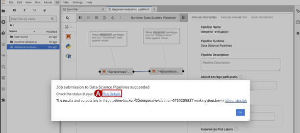

## Step 7: Run the pipeline
1. On the Pipeline editor, click the **Play** button to Run the Pipeline

2. Click **Ok**. A popup window will appear with a confirmation the pipeline has been started. Click the **Run Details (A)** link.

    
