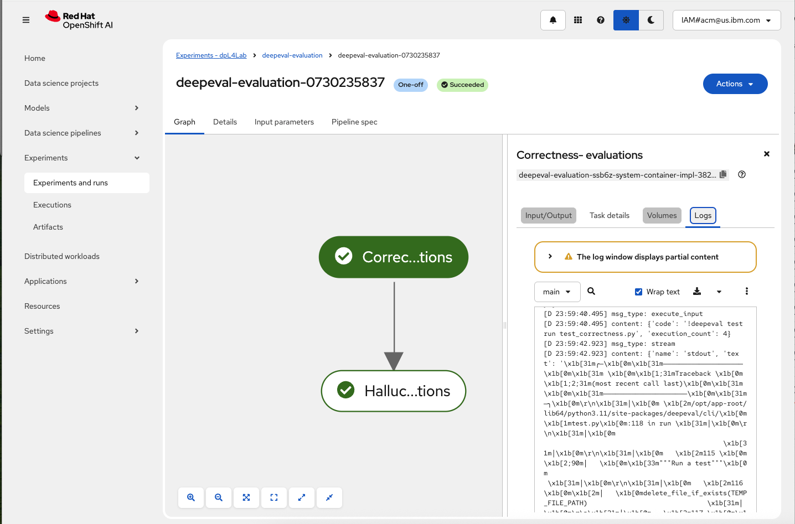
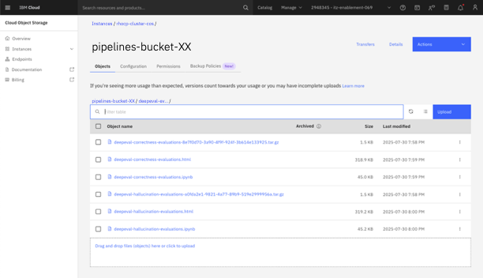

### Step 8: Verify pipeline results

1. The Run Details link will display the OpenShift AI console **Experiments and runs** screen with the pipeline run. Click on a node to display information about the node execution.

    
    > Observe that each node in the pipeline graph corresponds to a node in the workbench pipeline editor. Each node represents a container run given the image you specified in the node properties panel.

2. Go back to the IBM Cloud COS bucket that was created in [Step 1](#step-1-create-a-cos-bucket-with-credentials) and find the logs and output from the pipeline run that was just executed.

    

3. Open any of the `.html` files (i.e. `deepeval-correctness-evaluations.html`) to validate the evaluation test ran and the score. Scroll down to the bottom to see the evaluation results summary, which should look similar to below.

```html
Evaluating 1 test case(s) in parallel ━━━━━━━━━━━━━━━━━━━━━━━━━━━━━   0% 0:00:11
    🎯 Evaluating test case #0        ━━━━━━━━━━━━━━━━━━━━━━━━━━━━━   0% 0:00:11
Evaluating 1 test case(s) in parallel ━━━━━━━━━━━━━━━━━━━━━━━━━━━━━   0% 0:00:11
    🎯 Evaluating test case #0        ━━━━━━━━━━━━━━━━━━━━━━━━━━━━━   0% 0:00:11
Evaluating 1 test case(s) in parallel ━━━━━━━━━━━━━━━━━━━━━━━━━━━━━   0% 0:00:11
    🎯 Evaluating test case #0        ━━━━━━━━━━━━━━━━━━━━━━━━━━━━━   0% 0:00:11
Evaluating 1 test case(s) in parallel ━━━━━━━━━━━━━━━━━━━━━━━━━━━━━   0% 0:00:11
    🎯 Evaluating test case #0        ━━━━━━━━━━━━━━━━━━━━━━━━━━━━━   0% 0:00:11


======================================================================

Metrics Summary

  - ✅ Correctness [GEval] (score: 1.0, threshold: 0.5, strict: False, evaluation model: model-granite-33-8b-instruct (Local Model), reason: The actual output matches the expected output exactly in terms of both value and format, indicating a correct response according to the evaluation steps., error: None)

For test case:

  - input: What is the capital of France?
  - actual output: The capital of France is Paris.
  - expected output: The capital of France is Paris.
  - context: None
  - retrieval context: ['France is a country in Western Europe. Paris is located along the Seine River.']

======================================================================

Overall Metric Pass Rates

Correctness [GEval]: 100.00% pass rate

======================================================================


✓ Evaluation completed 🎉! (time taken: 11.64s | token cost: 0.0 USD)
» Test Results (1 total tests):
   » Pass Rate: 100.0% | Passed: 1 | Failed: 0

 ===============================================================================
=

» What to share evals with your team, or a place for your test cases to live? ❤️
🏡
  » Run 'deepeval view' to analyze and save testing results on Confident AI.


Running teardown with pytest sessionfinish...
```

***
