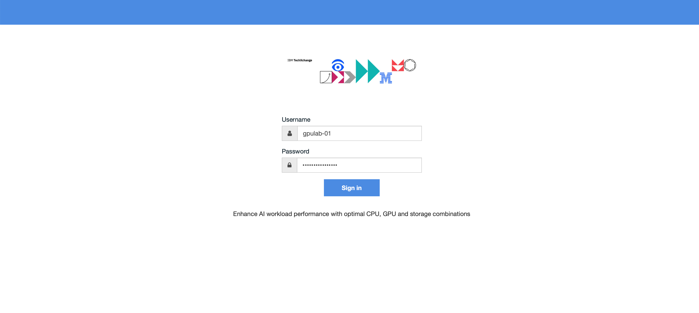
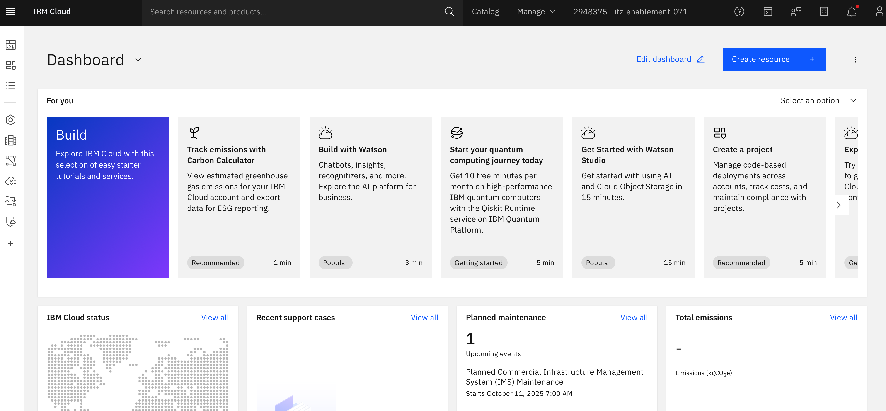

## Getting Started

### 1. Log in to IBM Cloud

1. Go to https://ibm.biz/txc-1827
2. Enter the `Username` and `Password` provided for the lab
3. Click on the `Sign in` button

4. The Cloud login page should look like below 

