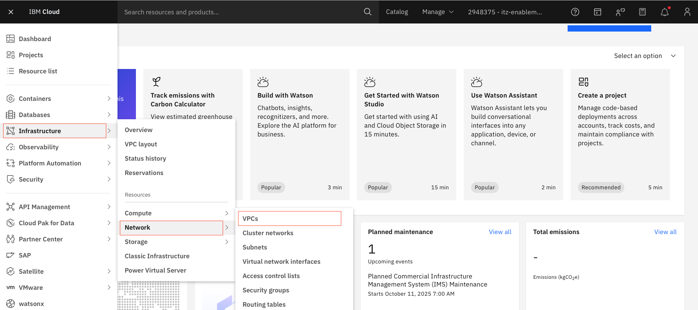
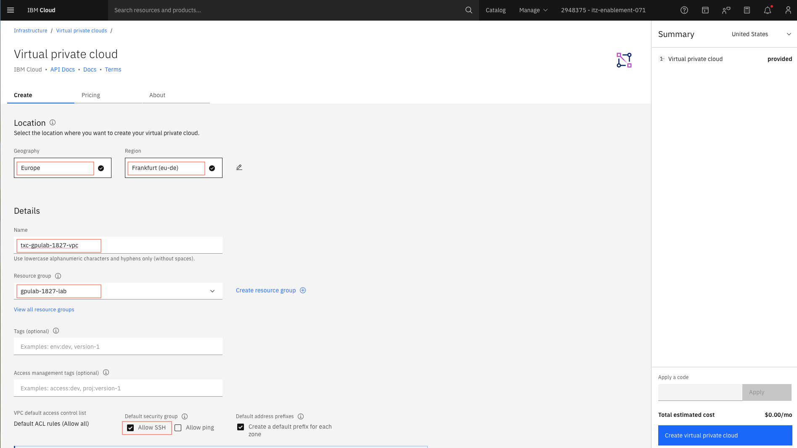
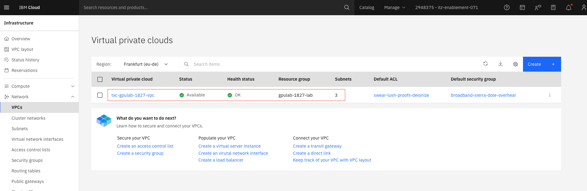

## Create a VPC

### 1. Create a VPC 

> [!NOTE]
> For the **txc-2025-gpulab-1827**, use the `txc-gpulab-1827-vpc` that has already been created.

1. Go to **Infrastructure -> Network-> VPCs**. 

&nbsp;

2. Click on the **Create** button.

* Select the **Geography** (`Europe`) and the **Region** ()`Frankfurt(eu-de)`)
* Provide the **Name** for the vpc (`txc-gpulab-1827-vpc`)
* Select the **Resource Group** (`gpulab-1827-lab`)
* Select to **Allow SSH**
* Take the defaults for the rest of the fields
* Click on **Create virtual private cloud** button to create the VPC.

&nbsp;

3. Check to see the VPC created

* Go to **Infrastructure -> Network-> VPCs**

&nbsp;
