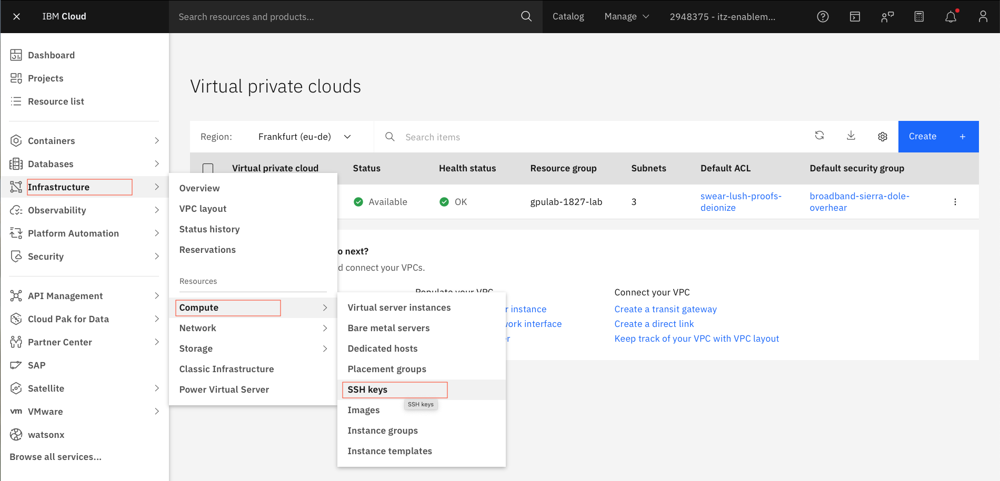
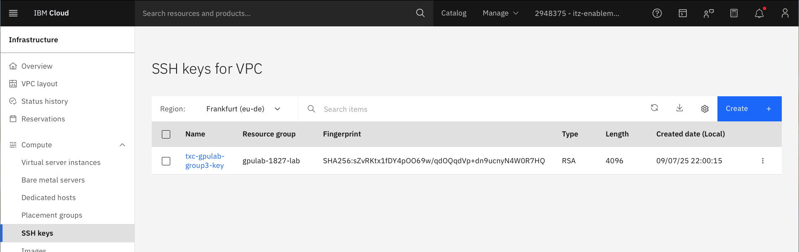
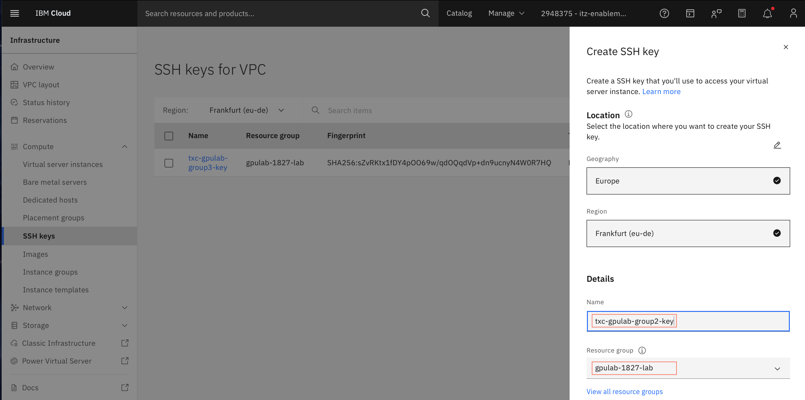
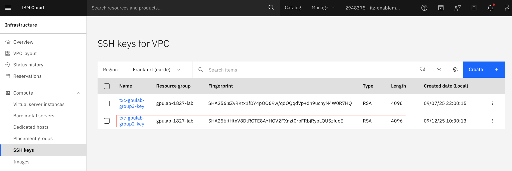

## Create a SSH Key 

1. Go to **Infrastructure -> Compute -> SSH keys**. 

&nbsp;

The `SSH Keys` page looks like below

&nbsp;

2. Click on the **Create** button.

* Select the **Geography** (`Europe`) and the **Region** (`Frankfurt(eu-de)`)
* Provide the **Name** for the ssh key (`txc-gpulab-`<**group number**>`-key`). Make sure to use your group number or your user-id to keep the resources unique.
* Select the **Resource Group** (`gpulab-1827-lab`)
* Click on **Create** button to create the key.
* Store the private key that gets downloaded.

3. Check to see the created ssh key

* Go to **Infrastructure -> Compute-> SSH keys**

&nbsp;
