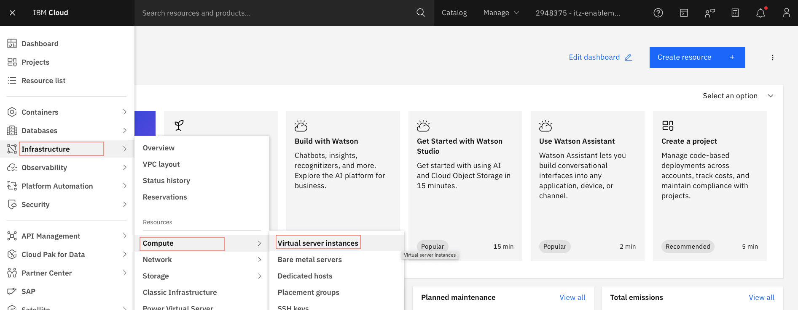
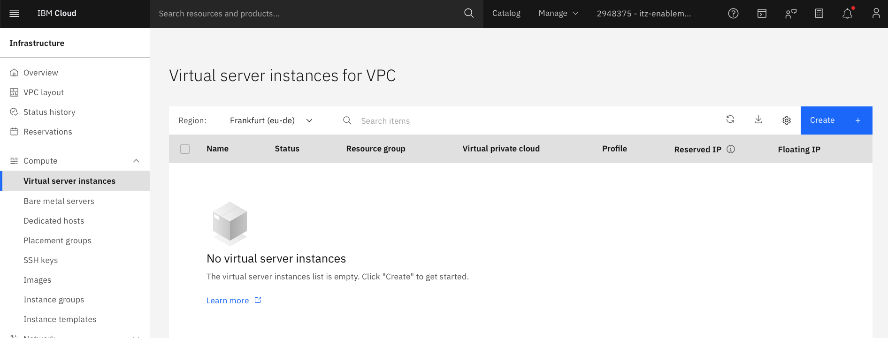
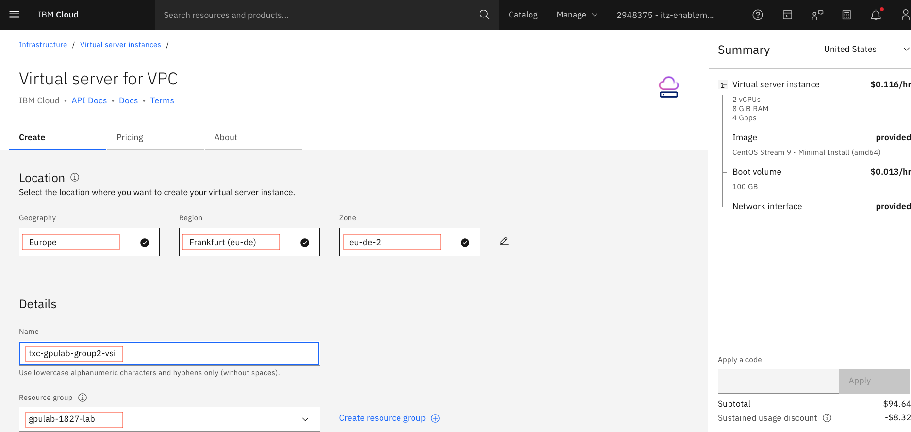
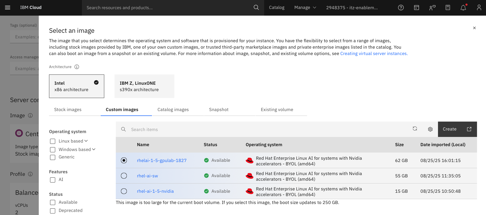
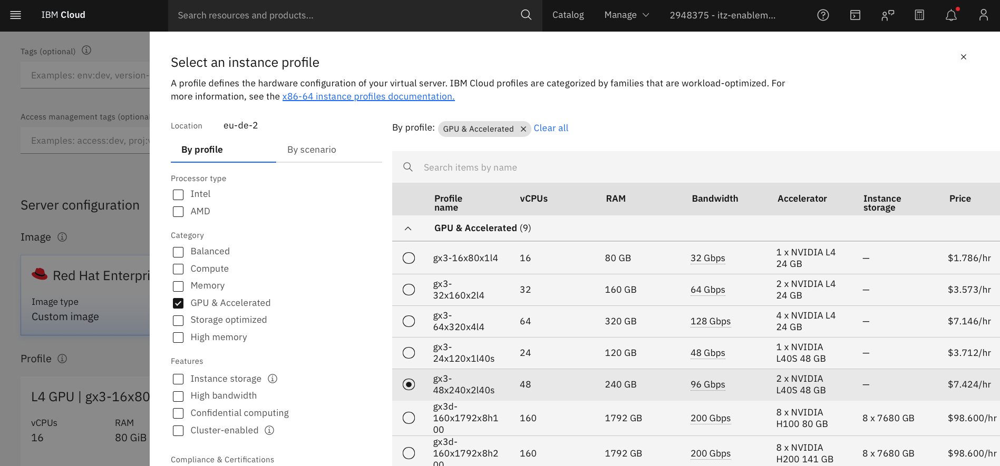
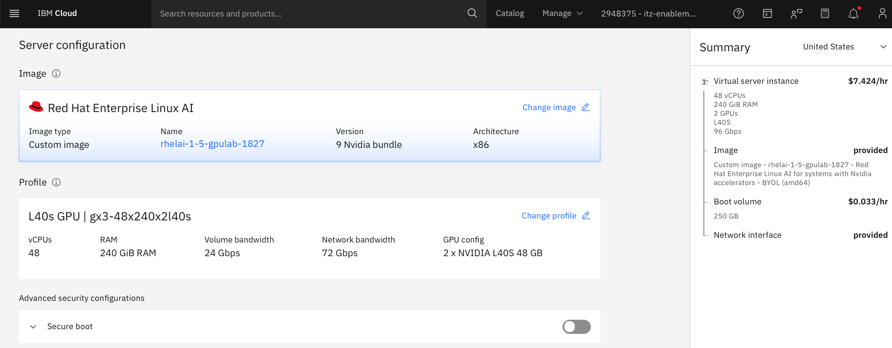
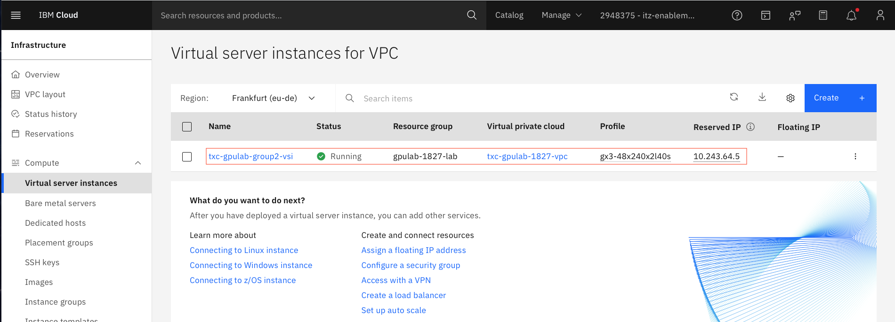

## Deploy a RHEL AI instance with GPUs on IBM Cloud

### 1. Go to `Infrastructure -> Compute -> Virtual server instances`. 

&nbsp;

The **Virtual server instances for VPC** page looks like below.

&nbsp;

### 2. Click on the `Create` button

* Choose the **Geography** (`Europe`), **Region** (`Frankfurt(eu-de)`) and the **Zone**
* Provide the **Name** for the virtual server (`txc-gpulab-`**group number**`-vsi`). Make sure to use your group number.
* Select the **Resource Group** (`gpulab-1827-lab`)

&nbsp;

* Click on **Change image** in the **Server configuration** section 
* Go to the **Custom images** tab. (Note: The reason for using a custom image is to save time during the lab. 1. The models are already downloaded. 2. The `guidellm` performance tool is also alredy installed. These are captured as part of the image)
* Select the `rhelai-1-5-gpulab-1827` image and click on **Save**

&nbsp;

* Click on **Change profile** in the **Server configuration** section 
* Select the **GPU & Accelerated** Catrgory 
* Select the `gx3-48x240x2l40s` profile and click on **Save**

&nbsp;

The server configuration should look like below.

&nbsp;

* Select the **SSH keys** created in the previous step (`txc-gpulab-`<**group number**>`-key`)
* Select the **Virtual private cloud** (`txc-gpulab-1827-vpc`)
* Click on  **Create virtual server** to create the VSI

### 3. Check the status of the virtual server

* Go to **`Infrastructure -> Compute -> Virtual server instances`**

> Expected provisioning time: 2 minutes

&nbsp;

