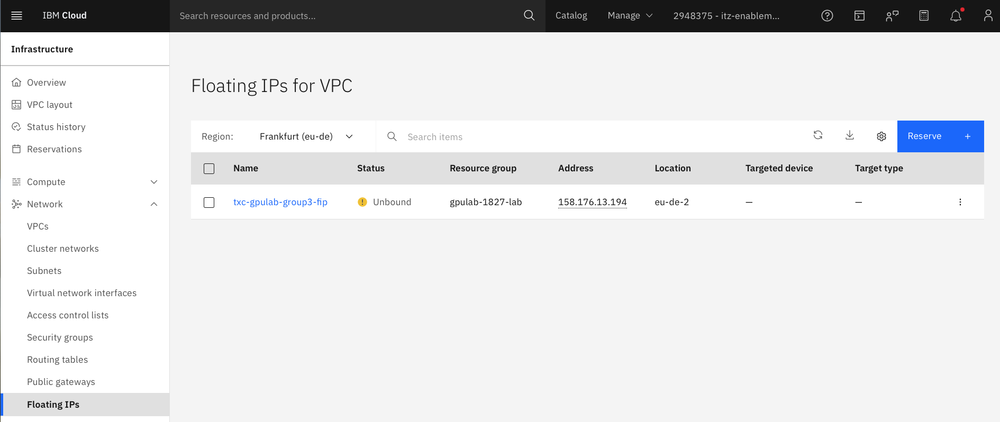
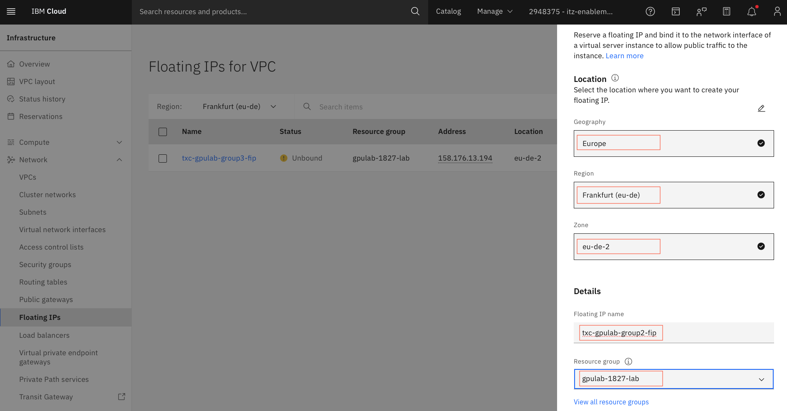
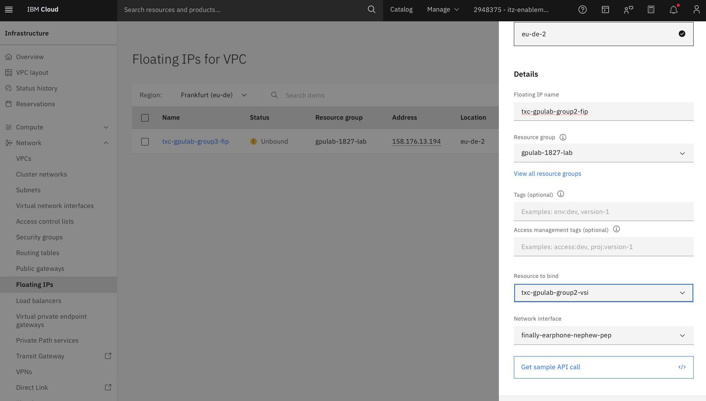
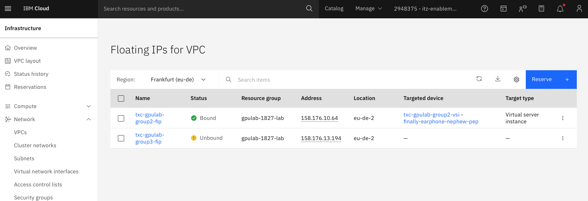

## Setup a Floating IP on the deployed instance

### 1. Go to `Infrastructure -> Network -> Floating IPs` 

&nbsp;

The **Floating IPs for VPC** page looks like below.

&nbsp;

### 2. Click on the `Reserve` button

* Choose the **Geography** (`Europe`), **Region** (`Frankfurt(eu-de)`) and the **Zone** (`eu-de-2`)
* Provide the **Floating IP name** for the floating IP (`txc-gpulab-`**group number**`-fip`). Make sure to use your group number or user-name to make the FIP name unique.
* Select the **Resource Group** (`gpulab-1827-lab`)

&nbsp;

* Select the server provisioned in the previous step (`txc-gpulab-`**group number**`-vsi`) in the **Resource to bind** drop down
* Click on the **Reserve** button

The Floating IP configuration should look like below.

&nbsp;

The Floating IP `txc-gpulab-`**group number**`-fip` should also be attached to the provisioned VSI.

### 3. Check the Floating IP on the virtual server

* Go to **`Infrastructure -> Compute -> Virtual server instances`**

&nbsp;

