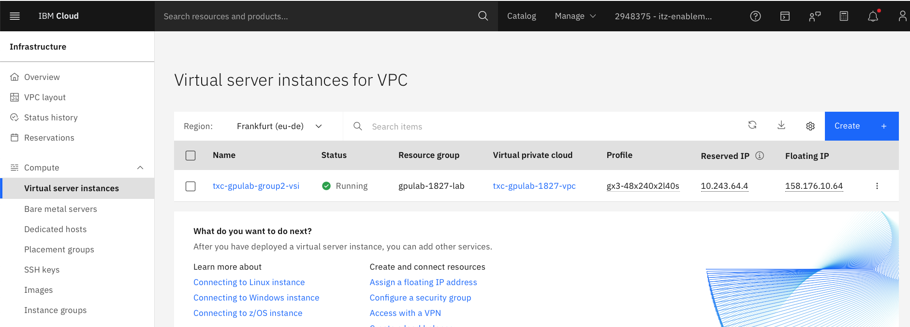
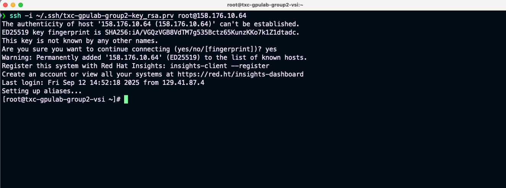

## Logon to the deployed RHEL AI instance

### 1. Go to **`Infrastructure -> Compute -> Virtual server instances`** and note down the Floating IP of the instance



<p>&nbsp;</p>

### 2. Change the permissions on the downloaded private key

``` bash
chmod 600 txc-gpulab-group2-key_rsa.prv
```

``` bash
ls -l txc-gpulab-group2-key_rsa.prv
-rw-------@ 1 dinakar  staff  3272 Sep 12 10:30 txc-gpulab-group2-key_rsa.prv
```

### 3. Go to a terminal and use ssh to logon to the instance 

* Use the downloaded private key (`txc-gpulab-<_group number_>-key`)
* Use the Floating IP

``` bash
ssh -i ./txc-gpulab-group1-key_rsa.prv root@<fip>
```




<p>&nbsp;</p>


### 4. Run the `nvidia-smi` command 
  
* Run the `nvidia-smi` command to see information about the GPUs available in the VSI.

``` bash
nvidia-smi
```

** Output:**

``` bash
[root@txc-gpulab-group1-vsi ~]# nvidia-smi
Wed Aug 27 13:38:55 2025
+-----------------------------------------------------------------------------------------+
| NVIDIA-SMI 550.163.01             Driver Version: 550.163.01     CUDA Version: 12.4     |
|-----------------------------------------+------------------------+----------------------+
| GPU  Name                 Persistence-M | Bus-Id          Disp.A | Volatile Uncorr. ECC |
| Fan  Temp   Perf          Pwr:Usage/Cap |           Memory-Usage | GPU-Util  Compute M. |
|                                         |                        |               MIG M. |
|=========================================+========================+======================|
|   0  NVIDIA L40S                    On  |   00000000:04:01.0 Off |                    0 |
| N/A   34C    P8             23W /  350W |       1MiB /  46068MiB |      0%      Default |
|                                         |                        |                  N/A |
+-----------------------------------------+------------------------+----------------------+
|   1  NVIDIA L40S                    On  |   00000000:04:02.0 Off |                    0 |
| N/A   33C    P8             23W /  350W |       1MiB /  46068MiB |      0%      Default |
|                                         |                        |                  N/A |
+-----------------------------------------+------------------------+----------------------+

+-----------------------------------------------------------------------------------------+
| Processes:                                                                              |
|  GPU   GI   CI        PID   Type   Process name                              GPU Memory |
|        ID   ID                                                               Usage      |
|=========================================================================================|
|  No running processes found                                                             |
+-----------------------------------------------------------------------------------------+
```

The above output confirms we have a server with two GPUs with id "0" and "1".


<p>&nbsp;</p>
