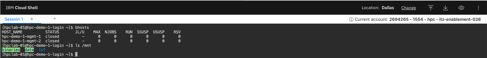

# Explore the IBM Cloud HPC environment


The IBM Cloud HPC environment can be deployed using automation. The automation is based on IBM Cloud Schematics and offers a rich set of terraform modules and scripts that follow the infrastructure-as-code best practice. 

After specifying required and optional parameters, the automation creates the infrastructure consisting of a VPC, subnets, bastion and login VMs as well as the management VMs that run the HPC Software. 

It follows security best practices by depoying the Bastion and Login nodes into different subnets than the Management nodes and applying different security groups to control the traffic flows between these two subnets. It also distributes the ssh-key and configures LDAP for user management (optional)

The management nodes are installing the Spectrum LSF software across two nodes to ensure redundancy and failover. After deployment, the environment is ready to submit jobs using the LSF command line. The system is configured to automatically spawn dynamic compute nodes. The user can choose optionally to setup static compute nodes. 

By default, the environment creates a File Share for VPC with three mount targets, which are mounted automatically to all management and compute nodes. This allows the user to access binararies and data from everywhere. Optionally, the administrator can decide to mount a Storage Scale cluster.

## Review deployed compute resources

1. Go to the list of [Virtual server instances for VPC](https://cloud.ibm.com/vpc-ext/compute/vs)
2. Make sure that the **Washington DC** region is selected
3. In the list you can identify the virtual servers:
   - **hpc-demo-1-bastion** - Exposed to the public internet with a floating IP
   - **hpc-demo-1-login** - The home of HPC users to submit and run jobs
   - **hpc-demo-1-mgmt-1** - The primary server running Spectrum LSF scheduler.
   - **hpc-demo-1-mgmt-2** - The secondary server to failover workload
4. These VSIs are provisioned and configured via the deployable architecture.


You might wonder a few things that are specific for the lab setup:
- the floating IP for the management node is used to make the application center available for the lab. In a production environment this would be done through an ALB and custom domain and certificate.
- the one additional compute node with profile _gx2-8x64x1v100_ is prepared for the GPU related part of the lab
- since this is a shared and dynamic HPC environment other attendees might have provisioned additional compute nodes that show up in the list.


## Review deployed network topology 

1. Go to the list of [Virtual private clouds](https://cloud.ibm.com/vpc-ext/network/vpcs)
2. Go to the list of [Subnets for VPC](https://cloud.ibm.com/vpc-ext/network/subnets)
3. You can find two subnets 
   - **hpc-demo-1-login-subnet** - run the login and bastion servers 
   - **hpc-demo-1-subnet** - run the management nodes and dynamic compute nodes. 
     - The public gateway allows the compute nodes to connect outbound to the public network


## Review configured storage mounts

1. Go to the list of [File storage shares for VPC](https://cloud.ibm.com/vpc-ext/storage/fileShares)
2. The file shares are mounted to login, management nodes and compute nodes
   - **hpc-demo-1-share** - used to store input and output data for the HPC and AI workload
   - **hpc-demo-1-share-1** - used to store the HPC and AI applications
   - **hpc-demo-1-share-2** - used to share control-data and logs of the HPC environment and LSF scheduler


## Login to the HPC Environment

So, let's login through the bastion and login node to get ready to submit your first job:

1. Open Cloud Shell
   
2. The Cloud Shell opens in a new browser tab
   
3. Download the helper login script
   ```
   ibmcloud cos download --region us-east --bucket txc-hpc-1554-tools --key login.sh login.sh
   ```
4. Login to the login node using the script. The script will automatically download the ssh-key and identify the public IPs of the bastion node and login to the login node
   ```
   sh login.sh
   ```
5. Verify if you can connect to the cluster and view the two management nodes
   ```
   bhosts
   ```
6. Verify if you can see the two mount points for data and tools:
   ```
   ls /mnt
   ```

   

?> **Congratulations!** You are now logged in to the cluster and ready to submit jobs
