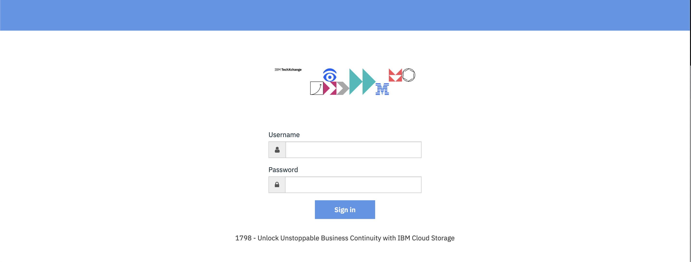
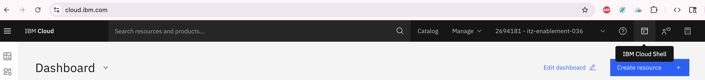
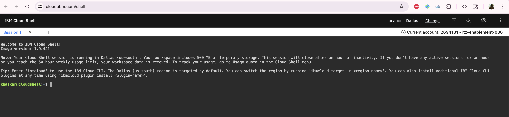
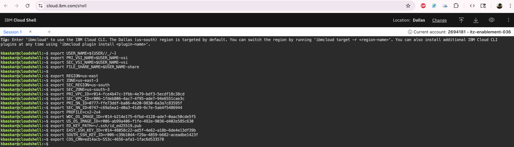
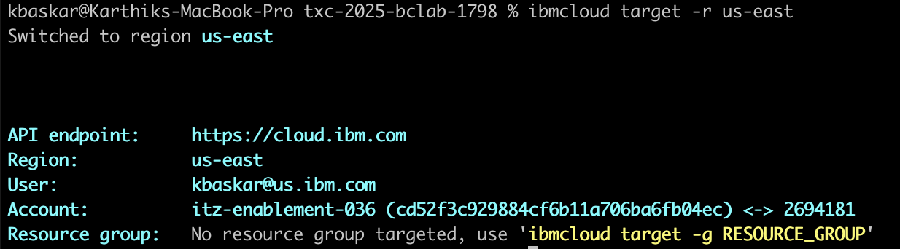
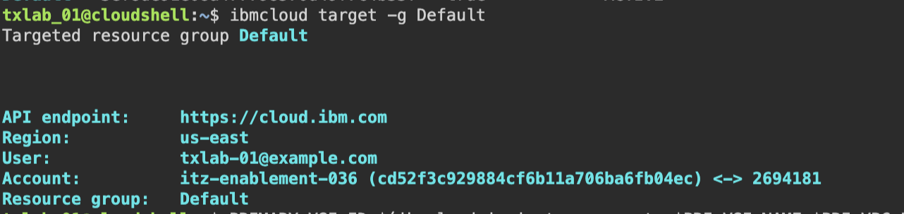

## Login in to IBM Cloud Portal (3 min)

### Retrieve the credentials to use for authentication

### Log in

1. Go to https://ibm.biz/TXC-2025-1798 and enter your credentials:

2. Click the cloud shell icon (top right) to open the IBM Cloud Shell (it will open in a new tab.)

The CLI portion of this lab uses session variables that may not persist if you logout or close your terminal.  If you lose your cloud shell, you may have to re-initialize these variables and download the ssh key again. 

## Set Session Variables
Copy and paste the following in your IBM Cloud Shell, then press enter:

~~~
export USER_NAME=${USER//_/-}
export PRI_VSI_NAME=$USER_NAME-vsi
export SEC_VSI_NAME=$USER_NAME-vsi
export FILE_SHARE_NAME=$USER_NAME-share

export REGION=us-east
export ZONE=us-east-3
export SEC_REGION=us-south
export SEC_ZONE=us-south-3
export PRI_VPC_ID=r014-fce4b47c-3fbb-4e79-bdf3-5ecdf18c38cd
export SEC_VPC_ID=r006-1fdeb806-4ac7-4f95-ade7-94e6551cae3c
export PRI_SN_ID=0777-ffe73ddf-ba86-4e20-9830-6a3a7c83595f
export SEC_SN_ID=0747-c69a5ea1-d0a3-41d9-9c7e-5ab4f5486944
export PROFILE=cx2-2x4
export WDC_OS_IMAGE_ID=r014-b214e175-6fbd-4128-ade7-0aac50cde5f5
export US_OS_IMAGE_ID=r006-ab99a406-f1fe-492e-9036-d402e585c630
export EAST_SSH_KEY_ID=r014-48058c22-ad5f-4e62-a18b-6de4e13df39b
export SOUTH_SSH_KEY_ID=r006-c39b10d4-f29a-4859-b682-aceadbe1423f
export COS_CRN=ed14acb-553c-4656-afa1-1fac6d533578
~~~

Verify user and target:

~~~
ibmcloud target
~~~

You should get an output that look like this:

API endpoint:     https://cloud.ibm.com
Region:           us-east
User:             email@us.ibm.com
Account:          itz-enablement-036 (cd52f3c929884cf6b11a706ba6fb04ec) <-> 2694181

If the region is not us-east, you need to change the target by typing the following:

~~~
ibmcloud target -r us-east
~~~

This should change your region for you:

Configure a resource group

~~~
ibmcloud target -g Default
~~~

⇨ [Continue to Deployment](20-lets-deploy.md)
 
