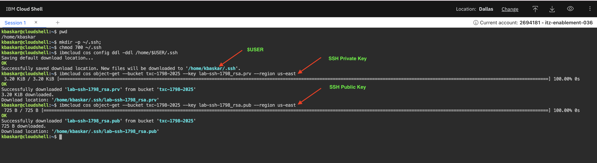
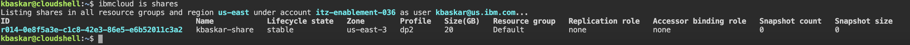
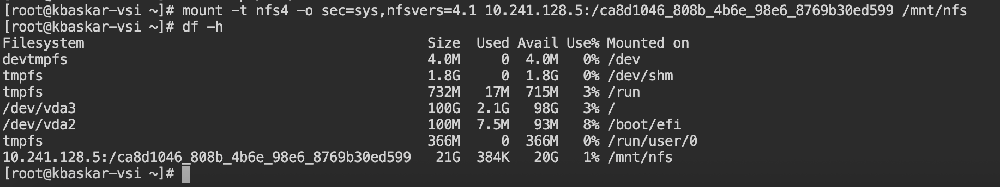
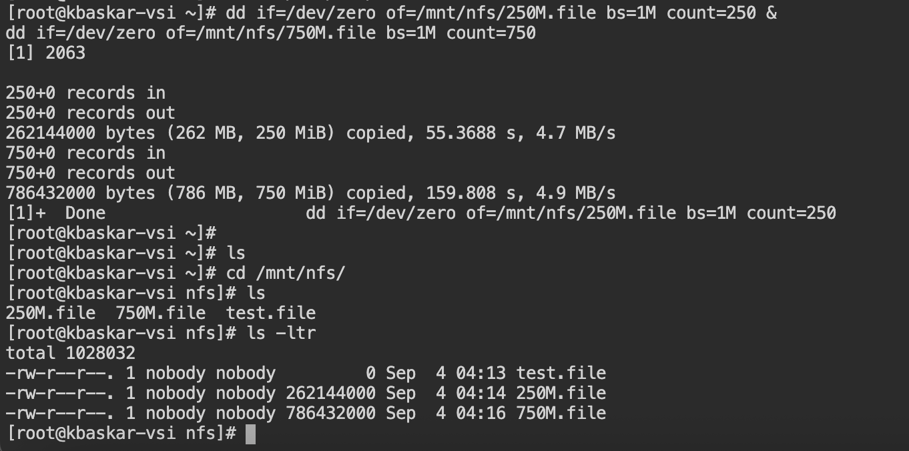

# Lets Deploy! (20 min)

## Download user-data & SSH Key from COS

### Configure the object storage plugin.

Use the following command to view the current config of the cos plugin:

~~~
ibmcloud cos config list
~~~

set the crn of object storage instance:

~~~
ibmcloud cos config crn --crn $COS_CRN
~~~

Confirm CRN has been set:

~~~
ibmcloud cos config list
~~~

### In the IBM Cloud Shell we need to download our ssh key from COS.  We will do that via the IBM Cloud CLI, but first we need to prepare the directory:

~~~
mkdir -p ~/.ssh;
chmod 700 ~/.ssh
~~~

Set the new download location:
~~~
ibmcloud cos config ddl -ddl /home/$USER/.ssh
~~~

You will receive the following output:

Saving default download location...
OK
Successfully saved download location. New files will be downloaded to '/home/attendee_XX/.ssh'.

## Download private key and change permissions:
~~~
ibmcloud cos object-get --bucket txc-1798-2025 --key lab-ssh-1798_rsa.prv --region us-east
~~~

~~~
ibmcloud cos object-get --bucket txc-1798-2025 --key lab-ssh-1798_rsa.pub --region us-east
~~~

~~~
chmod 600 ~/.ssh/lab-ssh-1798_rsa.prv;
chmod 644 ~/.ssh/lab-ssh-1798_rsa.pub
~~~

## Create a VSI and attach a Floating IP:
~~~
PRIMARY_VSI_ID=$(ibmcloud is instance-create $PRI_VSI_NAME $PRI_VPC_ID $ZONE $PROFILE $PRI_SN_ID --image $WDC_OS_IMAGE_ID --keys $EAST_SSH_KEY_ID  --output JSON | jq -r .id);
~~~

Confirm that your VSI has been provised and running.

~~~
ibmcloud is instance $PRIMARY_VSI_ID

~~~

Getting instance 0XXX_496bfa86-3845-XXX-XXX-d97002300e37 under account itz-enablement-043 as user txlab-03@example.com...
                                         
ID                                    0777_adecccc3-618b-43b9-a7f3-4edb451d0f44   
Name                                  kbaskar-vsi   
CRN                                   crn:v1:bluemix:public:is:us-east-3:a/cd52f3c929884cf6b11a706ba6fb04ec::instance:0777_adecccc3-618b-43b9-a7f3-4edb451d0f44   
Status                                running   
Availability policy on host failure   restart   
Confidential Compute Mode             disabled   
Enable Secure Boot                    false   
Startable                             true   
Profile                               cx2-2x4   
Architecture                          amd64   
vCPU Manufacturer                     intel   
vCPUs                                 2   
Memory(GiB)                           4   
Bandwidth(Mbps)                       4000   
Volume bandwidth(Mbps)                1000   
Network bandwidth(Mbps)               3000   
Lifecycle Reasons                     Code   Message      
                                      -      -      
                                         
Lifecycle State                       stable 

once it is running, let's confirm that it is available and online via ping.

~~~
PRI_VNI_ID=$(ibmcloud is instance $PRIMARY_VSI_ID --output JSON | jq -r .primary_network_attachment.virtual_network_interface.id);
~~~

~~~
FIP1=$(ibmcloud is floating-ip-reserve $USER_NAME-fip --vni $PRI_VNI_ID --output JSON | jq -r .address)

~~~

~~~
ping $FIP1

~~~
Once you get a response, 'CTRL+C' to exit.

Retrieve floating IP of newly create VSI:
~~~
echo $FIP1

~~~

## Create 20G File Storage Share:
~~~
PRIMARY_SHARE_ID=$(ibmcloud is share-create --name $FILE_SHARE_NAME --zone $ZONE --profile dp2 --size 20  --output JSON | jq -r .id)
~~~

View Share details
~~~
ibmcloud is share $PRIMARY_SHARE_ID
~~~

Once the share is available, run the following command to create a mount target

~~~
MOUNT_TARGET_ID=$(ibmcloud is share-mount-target-create $PRIMARY_SHARE_ID --subnet $PRI_SN_ID --output JSON | jq -r .id)
~~~

View Share mount target status
~~~
ibmcloud is shrmts $PRIMARY_SHARE_ID
~~~

You will receive a following output

Listing share mount target of r014-0e8f5a3e-c1c8-42e3-86e5-e6b52011c3a2 in all resource groups and region us-east under account itz-enablement-036 as user email@us.ibm.com...
ID                                          Name                        VPC                Lifecycle state   Transit Encryption   
r014-291c9d63-7a62-41d7-8837-3d558817c2a3   most-stark-sanded-violist   lab-primary-1798   stable            none   

~~~
MOUNT_PATH=$(ibmcloud is share-mount-target $PRIMARY_SHARE_ID  $MOUNT_TARGET_ID  --output JSON | jq -e .mount_path)

~~~

View and take note of Mount Path (hint: you can always get the mount path from the UI):
~~~
echo $MOUNT_PATH
~~~

ssh into server using the floating IP in your list:
~~~
ssh -i ~/.ssh/lab-ssh-1798_rsa.prv root@$FIP1
~~~

Create a new directory:
~~~
mkdir -p /mnt/nfs
~~~

Mount the NFS Share to newly created directory with the mount path listed above:
~~~
mount -t nfs4 -o sec=sys,nfsvers=4.1 <host_ip:/host_path> <local_path>

~~~ 
Example 'mount -t nfs4 -o sec=sys,nfsvers=4.1 10.241.128.5:/ca8d1046_808b_4b6e_98e6_8769b30ed599 /mnt/nfs'

Check that your mount was succesful. You should see a line at the bottom with the mounted file share
~~~
df -h

~~~

Now lets test access:
~~~
touch /mnt/nfs/test.file;
echo "This is for cross region restore testing" > /tmp/restore.txt ;
~~~

Lets create a couple of test files to replicate. These two commands will take about 3~4 min to complete. 

~~~
dd if=/dev/zero of=/mnt/nfs/250M.file bs=1M count=250 &
dd if=/dev/zero of=/mnt/nfs/750M.file bs=1M count=750

~~~

And by now, you should have a few files in your /mnt/nfs directory, let's list all files:
~~~
cd /mnt/nfs/;
ls -ltr
~~~

You will have output similar to this:

⇨ [Continue to Portal Time](30-portal-time.md)
