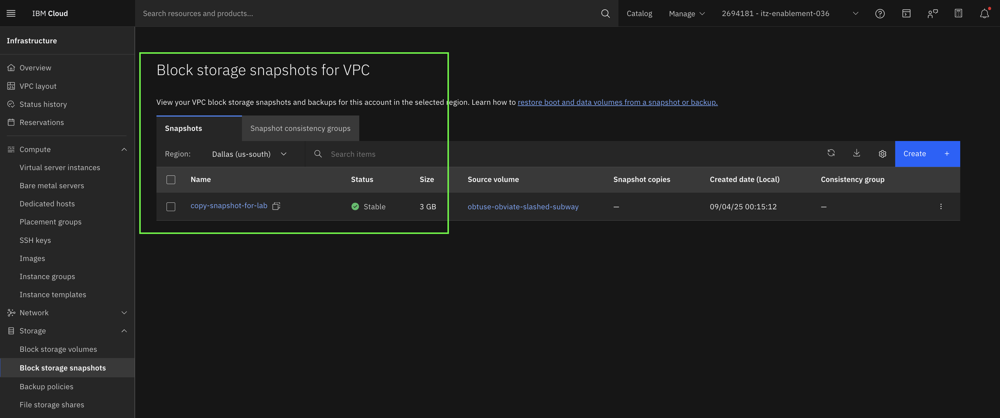

# Return to previous portal tab

## Navigate to Infrastructure
1. Click top left hamburger menu


2. Scroll down to **Infrastructure**


3. Click the Pin next to Infrastructure to pin the menu option to the top.
4. Choose **Virtual Server Instances** within the **Compute** sub-menu on the **Infrastructure** menu. This will take you to the VSI listing.
5. If you are not in the **Washinton DC** region, please change it via the drop dowm at the top of the list.


6. Click on your VSI Name.

## Create snapshot of Boot Volume

7. Scroll down to the section that says **Storage**
8. Click on the Boot Volume Name


9. Click **Snapshots and backups** tab across top of screen
10. Click blue **Create +** button on right.


11. Choose the following options on this create snapshot page

>Location: pre-selected<br>
>Snapshot Type: Single volume<br>
>Name: vm-snapshot-your-lastname<br>
>Optional Configurations: check the **Copy snapshot to different region**<br>

Hint: you might want to use a unique name to easily find your snapshot later.
  

  
12. This will reveal a new blue create button.  
13. Click "Create +"


14. Then click “Create block storage snapshot” in the lower right corner


### This will effectively create a point in time copy of the data of your boot volume, and then, the snapshot will be offloaded to COS. In parallel, the snapshot is being copied to us-south.
  
You should be on the list of Block Storage Snapshot list. Look for your snapshot in the list
and click on the name.

On the bottom right of this page, you will see the "Remote Copies" section. If the Snapshot Status says "Pending", that's because the data is being transferred from the source region to the destination region. When the status says "Stable", you can continue.

## Data is protected!
  Now that you have protected your VPC Block Storage volume with a snapshot and copied the snapshot to a different MZR, let's re-create the deployment in Dallas by restoring the snapshot to a new VSI.


Go to the "Block storage snapshots" section and make sure you are on the Dallas MZR, if you're still on WDC, select Dallas from the drop down:
 

Once you are in Dallas, you will see the list of all the snapshots in that specific MZR, wait for the sanpshot to be `stable` then click on your snapshot name, and select "Create volume" from "Actions" dropdown, this will bring a new
panel on the right hand side.

  You will need to select the "Attach volume to a virtual server" checkbox, then select the "Attach new volume to a new virtual server" option, which will display a button that will take you to the VSI provisioning page, click on it:
  

Input a name for your new VSI, your snapshot will be pre-selected as the image for this VSI, select the "lab-ssh-1798" on the SSH keys section, zone "us-south-3" you can select one of
the pre-defined VPCs available, or you can create your own VPC. Once all the required values are filled in, you will be able to create a new VSI from your snapshot, click "Create virtual server":
  

  You should now be able to see your new VSI on the VSI list:
  

  You will now need to assign a new floating IP, in order to do that, click on your VSI name to go to the VSI details page.
  
  Once on the details page, click on the "Networking" tab and click the three dots of your vNIC, select "Edit floating IPs" and that will bring a new panel:

  

  Click on "Attach +"

  

  Click on the "Attach" button, and then "Reserve new floating IP", give it a name and the click "Reserve" and `X` to close the window:
  

  Your new floating IP address is ready and associated to your vNIC:
  

Keep the FIP ready, in the next step we'll verify the data we dumped in WDC volume

Note: The default Security group should allow ssh traffic.

### Set Session Variables
If Cloud CLI browser tab still open, go to that browser tab, or else Open the IBM Cloud Shell prompt

Copy and paste the following in your IBM Cloud Shell, then press enter:

~~~
export COS_CRN=ed14acb-553c-4656-afa1-1fac6d533578
~~~

set the crn of object storage instance:

~~~
ibmcloud cos config crn --crn $COS_CRN
~~~

Confirm CRN has been set:

~~~
ibmcloud cos config list
~~~

### In the IBM Cloud Shell we need to download our ssh key from COS.  We will do that via the IBM Cloud CLI, but first we need to prepare the directory:

~~~
mkdir -p ~/.ssh;
chmod 700 ~/.ssh
~~~

Set the new download location:
~~~
ibmcloud cos config ddl -ddl /home/$USER/.ssh
~~~

You will receive the following output:
~~~
Saving default download location...
OK
Successfully saved download location. New files will be downloaded to '/home/attendee_XX/.ssh'.
~~~

## Download private key and change permissions:
~~~
ibmcloud cos object-get --bucket txc-1798-2025 --key lab-ssh-1798_rsa.prv --region us-east
ibmcloud cos object-get --bucket txc-1798-2025 --key lab-ssh-1798_rsa.pub --region us-east
chmod 600 ~/.ssh/lab-ssh-1798_rsa.prv;
chmod 644 ~/.ssh/lab-ssh-1798_rsa.pub
~~~

ssh into server using the dallas VSI floating IP:
~~~
ssh -i ~/.ssh/lab-ssh-1798_rsa.prv root@<FIP2>
~~~

Example 'ssh -i ~/.ssh/lab-ssh-1798_rsa.prv root@67.18.93.231'

Answer "yes" when prompted following message

```text
The authenticity of host '52.117.127.120 (52.117.127.120)' can't be established.
ECDSA key fingerprint is SHA256:3Uiea6CWJxHMXDGyDeh6FY7AzOAykhTLLMmXAURdW6o.
Are you sure you want to continue connecting (yes/no/[fingerprint])?
```

Check the file created in WDC volume
~~~
cat /tmp/restore.txt
~~~

It will return the following text "This is for cross region restore testing"
  
## Let's now protect file storage
  Now that your VPC Block Storage volume is protected, let's protect your file share. We will use replication to protect our data in a different availability zone within the same MZR (Tip: you could replicate to a different MZR if needed, this is useful on data migration use cases.)

 Go back the IBM Cloud UI, go to the "File Storage shares" section within Infrastructure and make sure you are on the WDC MZR, then click on your file share and in Overview tab, see "File share details" (Hint: it will have your user as part of the file share name). 
  
  In "File share details, scroll down to the "File share replication relationship", Since replication hasn't been setup, click "Create replica" button, which will open a new tab to provision the replica:
  

This provisioning page will show your source file share details, a target AZ (different than the source) will already be selected, you can change this selection to different AZ or even a different MZR at this stage. For this exercise, I'm going to leave WDC1 (source file share was created in WDC3):


Add a name to your replica share, you can optionally add it to a resource group and add tags. You will also need to select the number of IOPS, since this is a replica, let's set it to the minimum of 100 for now.

You could also add mount targets at this stage, but we won't do it just yet. Let's go to Sync frequency, this will set up how often replication will happen. You can select a predefined frequency (hourly, daily, weekly, monthly), or you can add a CRON expression. 

For this exercise, let's replicate hourly at 30 minutes past the hour. Select hourly and start time = 30, once ready, click on create file share:


This will create a replica of your file share in WDC1 and you should be able to see your newly created replica on your file share list (if you created the replica in a different MZR, you will have to select that MZR so that the replica is shown on the list).

This effectively created the replica in a different AZ and will sync the information every hour at 30 minutes past the hour.


  ## Have time left over?
  
  After the conclusion, you can go to the optional activities section, where we will learn how to create backup policies for your block storage snapshots.
 


⇨ [Continue to Conclusion](40-conclusion.md)
