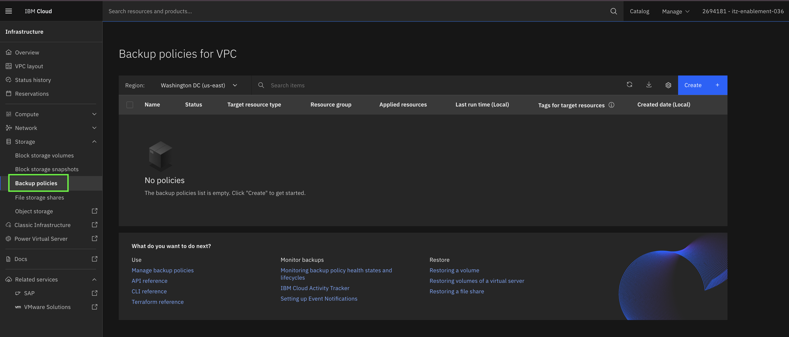
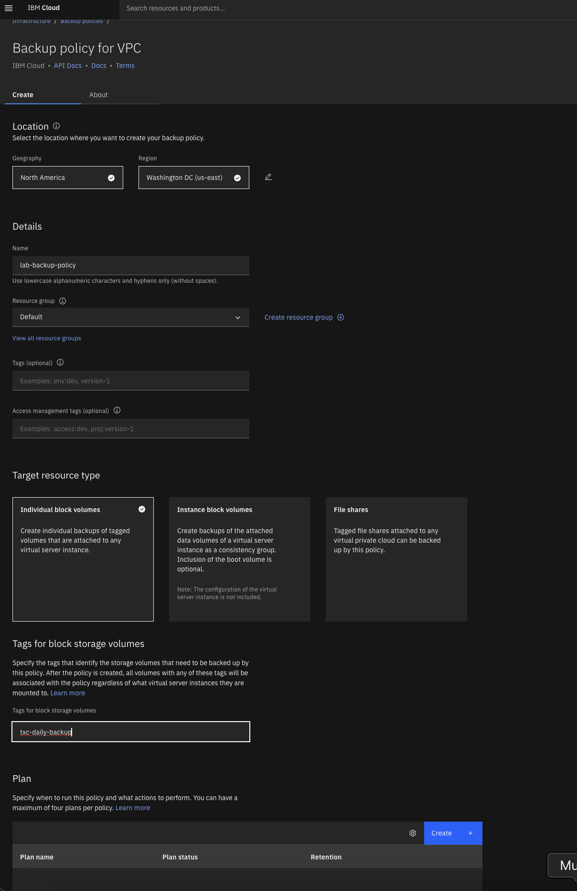
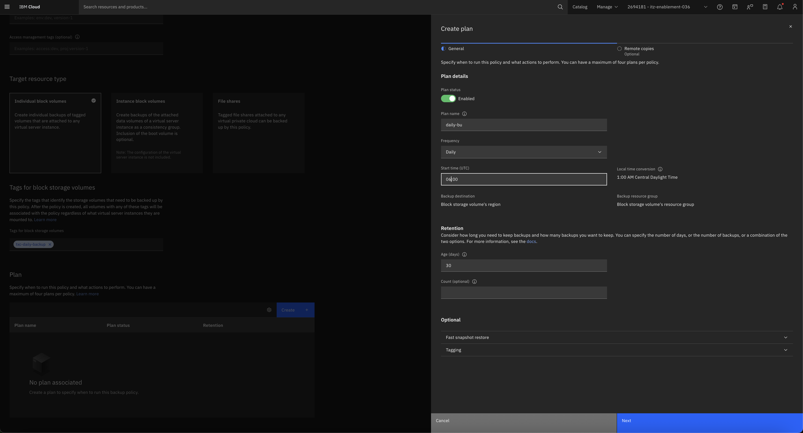
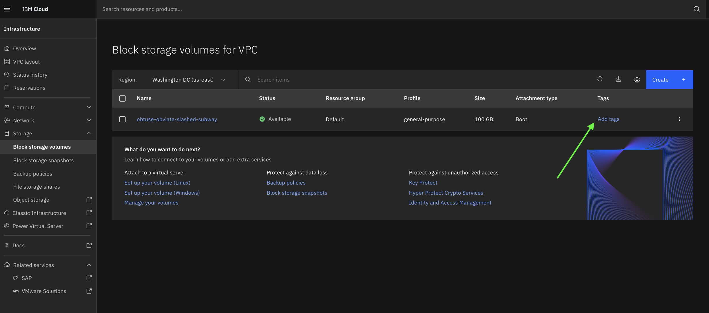
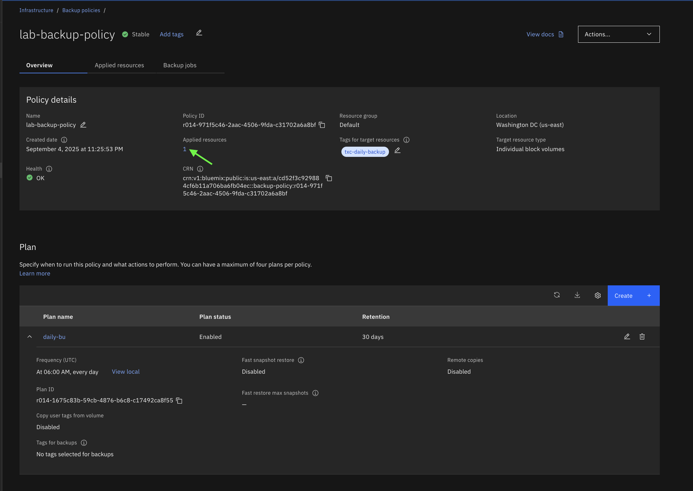

# Optional activity

## Congratulations! seems like you've finished the lab, but wait, there are still things we can do to automate data protection.

Let's take a look at how to automate the snapshot taking process. In this section we will review IBM Cloud Backup for VPC, which will allow you to automate your backups.

There are multiple ways to get to backup policies on the UI, the first is from the volume details page, or optionally, you could go to the Backup policies sub-section on the Storage section within the VPC console.

I'm going to start from the Backup policies section, from that window, select "Create":

Now you will have to name your new backup policy, you can optionally add tags and access management tags to your policy for easier management.

Once you've done that, you'll have to select the "Target resource type", on this example we will target "individual block volumes", but you could target "Instance block volumes" if you wanted to backup your crash consistency groups, which are basically snapshots of all the volumes attached to one instance or "File shares" for share snapshots automation.

Now, how will the backup policy know which volumes I want to backup? We have to setup volume tags, and that's exactly how the service will know which volumes need to be picked up by this policy. We will finish setting up the policy first, and then we will go and tag our volume so that the policy can automatically back it up. 

For this example, I'm going to use the "txc-daily-backup" tag, but you can use any tag you want.

At this point, we've entered the policy details, now we have to create a plan, click "Create":

You will have to give your plan a name. Since my tag already implies that I'm doing a daily backup, I'm just going to name this plan "daily-bu". I will set the frequency to "Daily", and I'm going to set the time to "06:00", which is midnight central time, this way, my backup job will run at the time of day I expect less operations.

I can also set the retention policy on this screen, you can specify the number of days, or the number of backups, or a combination of the two options. I will leave the default for now (30 days) and will hit "Next".

I will not be creating any remote copies as part of this backup, so I will now hit "Apply changes" and then I will click on "Create backup policy".

Now you will have to go to the volume(s) you want to automatically backup by this policy and add the tag you defined in your policy i.e. "txc-daily-backup". Go to the block volumes section, select your volume and click on "Add tags":

Now that the tag is added, if you go to the "Backup policies" tab within the details page, you should be able to see your policy:

[Hope you enjoyed the Lab](90-conclusion.md)
