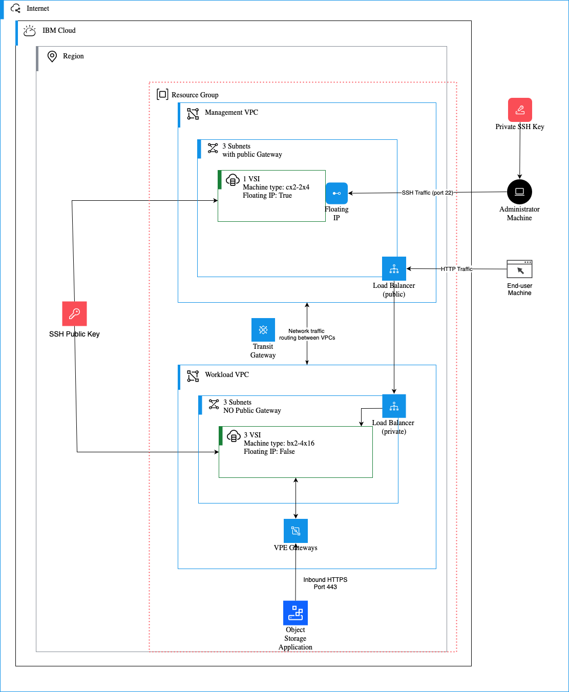

# 🌐 Secure and Scalable Infrastructure Architecture

As a platform engineer, your goal is to create a reliable and secure foundation for applications. This lab shows you how to build a "hub-and-spoke" network architecture in IBM Cloud. This design is a standard industry practice for isolating environments and controlling traffic flow.

## Architecture: Hub-and-Spoke Model

The core of our design is a hub-and-spoke model, which separates the management and workload environments for better security and organization.

Here are the key components you will build:

-   **Management VPC (The Hub)**: This is the central point of connectivity and management.
    -   **Jumpbox Server**: A secure virtual server used by administrators to access and manage the workload servers. It's the only part of the infrastructure that can be reached from the public internet (via SSH), acting as a secure gateway.
    -   **Public Load Balancer**: Distributes incoming public traffic to the private load balancer in the workload VPC, ensuring that the workload servers themselves are never exposed directly.

-   **Workload VPC (The Spoke)**: This VPC is isolated from the public internet and hosts the application.
    -   **Workload Servers**: These virtual servers run the application. They are in a private subnet and cannot be accessed directly from the internet.
    -   **Private Load Balancer**: Receives traffic from the public load balancer and distributes it across the workload servers.

-   **Secure Connectivity**:
    -   **Transit Gateway**: Connects the Management VPC and the Workload VPC, allowing them to communicate over the private IBM Cloud backbone.
    -   **Security Groups & Network ACLs**: Firewall rules at the server and subnet level that control exactly what traffic is allowed to flow between components.

-   **Private Access to IBM Cloud Services**:
    -   **Virtual Private Endpoints (VPEs)**: Allow the workload servers to connect to IBM Cloud services, like Cloud Object Storage, over a private connection instead of the public internet.

## Why This Architecture?

This design provides several key benefits for an enterprise environment:

-   **Security**: The workload servers are completely isolated from the public internet, reducing the attack surface. All access is controlled through the jumpbox and load balancers.
-   **Scalability**: The modular design allows you to add more workload VPCs (spokes) as your organization grows, without having to redesign the core network.
-   **Resiliency**: By deploying resources across multiple Availability Zones, the infrastructure can withstand a zone-level failure, ensuring your application remains available.
-   **Centralized Management**: The hub VPC provides a single place to manage security, access, and connectivity for all connected workload environments.

As a platform engineer, automating the deployment of this architecture allows your organization to quickly and consistently spin up new, secure environments.

---

[Next: Preparing for Deployment](./03-preparing-for-deployment.md)
