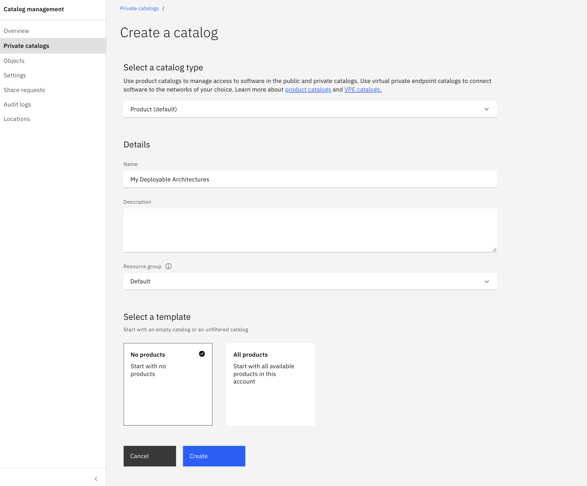
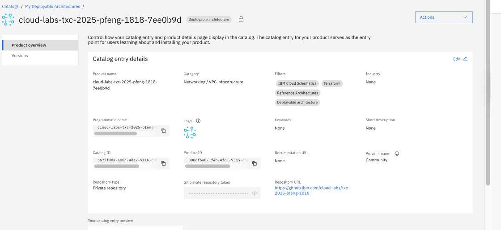
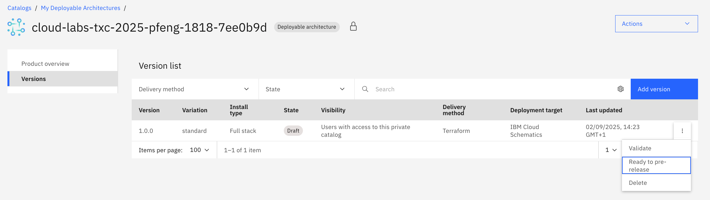

# 📦 Packaging as a Deployable Architecture (DA)

You have successfully built and tested a secure infrastructure using Terraform. The final step in the platform engineering lifecycle is to package this automation so that others in your organization can easily reuse it.

You will package your Terraform code as a **Deployable Architecture (DA)** and publish it to a **private catalog**. This creates a self-service experience, allowing developers and other teams to deploy this entire architecture with just a few clicks in the IBM Cloud console, without needing to understand the underlying Terraform code.

## Step 1: Create a Private Catalog

A private catalog is a way to share your Deployable Architectures within your IBM Cloud account.

1. In the IBM Cloud console (for your Target Deployment Account), navigate to **Manage > Catalogs**.
2. Click **Create a catalog**.
3. Enter a name for your catalog (e.g., `My Deployable Architectures`), a description (optional) and a resource group (e.g., `Default`).
4. You can start with "No products" template.
5. Click **Create**.

## Step 2: Onboard the Deployable Architecture

Now, you will add your Terraform bundle to the private catalog.

> **Note:** In a real-world scenario, the `.tar.gz` file is typically generated from a release in a source code repository like GitHub or GitLab. For this lab, a public URL to the bundle is provided to simplify the process.

**Public URL:** https://github.com/IBM/deployable-architecture-iac-lab-materials/archive/refs/tags/v1.0.3.tar.gz

1.  From your private catalog's page, click **Add product**.
2.  Configure the product details:
    *   **Product type**: Select **Deployable architecture**.
    *   **Delivery method**: Choose **Terraform**.
    *   **Repository type**: Select **Public repository**.
    *   **Source URL**: Paste the URL provided for the lab's `.tar.gz` file.
    *   **Version**: Enter a version like `v1.0.0`.
    *   **Variation**: Enter `standard` as the variation name.
    *   **Category**: Select a category, such as `Networking/VPC infrastructure`.
3.  Click **Add product**.

After a few moments, your Deployable Architecture will be onboarded and will be in a `Draft` state.

## Step 3: Mark as Pre-release

For this lab, we will skip the full validation process to save time. Instead, we will mark the version as a "pre-release". This makes it available for deployment without requiring the lengthy validation step.

**When to use Pre-release vs. Validated:**
*   **Pre-release**: Ideal for development and testing. It allows you to quickly share a new version with trusted users or other accounts without waiting for validation. It is not considered production-ready.
*   **Validated & Published**: The standard for production. A validated DA has been fully tested by the platform, including a successful `terraform apply`, cost estimation, and security scans. Publishing it makes it officially available in the catalog.

To mark the version as pre-release:
1.  From the product overview page, click on the **Versions** on the left and then click on the version number to go to the version details.
2.  Click the **kebab menu (⋮)** next to the "Validate" button.
2.  Select **Ready to pre-release**.
3.  Confirm the action.

Your Deployable Architecture is now ready for use in projects.

## Step 5: See Your Deployable Architecture in Action

Now that you've published your Deployable Architecture, see how it appears to users in your organization:

1. Navigate to the **Catalog** in the IBM Cloud console.
2. On the left-hand side, under **My private catalogs**, select the name of the private catalog you created earlier (e.g., `My Deployable Architectures`).
3. You should see your Deployable Architecture listed and ready for use.
4. Click on your Deployable Architecture to open it. This view shows what users in your organization will see - a description, architecture diagram, and a "Configure and deploy" button that lets them deploy the entire hub-and-spoke topology without writing any Terraform code.

This is the key benefit of creating a Deployable Architecture: your organization can now deploy this complex infrastructure consistently with just a few clicks, reducing deployment time while maintaining security standards.

---

[Next: Final Review and Conclusion](./08-final-review-cleanup.md)
