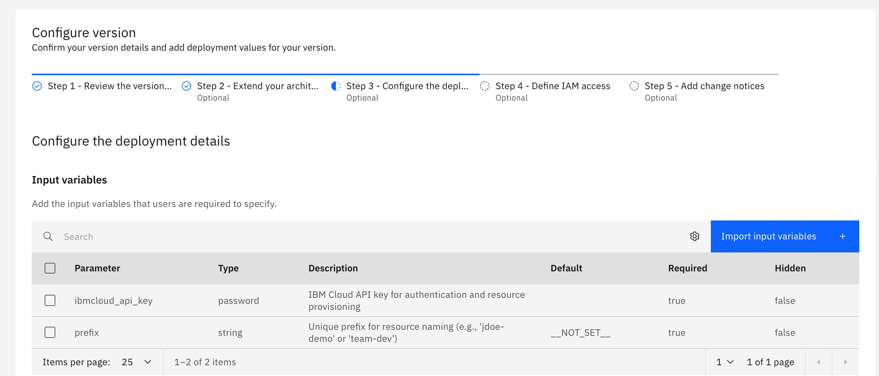
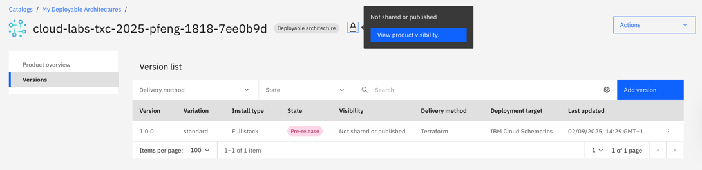

# 📦 Packaging as a Deployable Architecture (DA)

You have successfully built and tested a secure infrastructure using Terraform. The final step in the platform engineering lifecycle is to package this automation so that others in your organization can easily reuse it.

You will package your Terraform code as a **Deployable Architecture (DA)** and publish it to a **private catalog**. This creates a self-service experience, allowing developers and other teams to deploy this entire architecture with just a few clicks in the IBM Cloud console, without needing to understand the underlying Terraform code.

## Step 1: Create a Private Catalog

A private catalog is a way to share your Deployable Architectures within your IBM Cloud account.

1. In the IBM Cloud console, navigate to **Manage > Catalogs**.
2. Click **Create a catalog**.
3. Enter a name for your catalog (e.g., `My Deployable Architectures`), a description (optional) and a resource group (e.g., `Default`).
4. You can start with "No products" template.
5. Click **Create**.

## Step 2: Onboard the Deployable Architecture

Now, you will add your Terraform bundle to the private catalog.

> **Note:** In a real-world scenario, the `.tar.gz` file is typically generated from a release in a source code repository like GitHub or GitLab. For this lab, a public URL to the bundle is provided to simplify the process.

**Public URL:** https://github.com/IBM/deployable-architecture-iac-lab-materials/archive/refs/tags/v1.0.0.tar.gz 

1.  From your private catalog's page, click **Add product**.
2.  Configure the product details:
    *   **Product type**: Select **Deployable architecture**.
    *   **Delivery method**: Choose **Terraform**.
    *   **Repository type**: Select **Public repository**.
    *   **Source URL**: Paste the URL provided for the lab's `.tar.gz` file.
    *   **Version**: Enter a version like `v1.0.0`.
    *   **Variation**: Enter `standard` as the variation name.
    *   **Category**: Select a category, such as `Networking/VPC infrastructure`.
3.  Click **Add product**.

After a few moments, your Deployable Architecture will be onboarded and will be in a `Draft` state.

## Step 3: Configure the Input Variables

The final step is to configure how the input variables (`prefix` and `ibmcloud_api_key`) will be handled when someone deploys the architecture.

1.  From the product overview page, click on the version number to go to the version details.
2.  In the **Configure Version**, select the **Step 3: Configure the deployment** tab.
3.  Click on the **Import input variables**, and you will see your two input variables listed. Select both of them and then **add**".
    *   For the `ibmcloud_api_key`, we want to ensure it is treated as a secure secret.
    *   For the `prefix`, we want to let the user provide their own.

## Step 4: Mark as Pre-release

For this lab, we will skip the full validation process to save time. Instead, we will mark the version as a "pre-release". This makes it available for deployment without requiring the lengthy validation step.

**When to use Pre-release vs. Validated:**
*   **Pre-release**: Ideal for development and testing. It allows you to quickly share a new version with trusted users or other accounts without waiting for validation. It is not considered production-ready.
*   **Validated & Published**: The standard for production. A validated DA has been fully tested by the platform, including a successful `terraform apply`, cost estimation, and security scans. Publishing it makes it officially available in the catalog.

To mark the version as pre-release:
1.  From the product version page, click the **kebab menu (⋮)** next to the "Validate" button.
2.  Select **Ready to pre-release**.
3.  Confirm the action.

Your Deployable Architecture is now ready for use in projects.

## 🔄 (Optional) Share the Deployable Architecture (DA) Across Other Private Catalogs or IBM Cloud Accounts

You can share your product version with:
- Other private catalogs within the same IBM Cloud account.
- Other IBM Cloud accounts you own or collaborate with.

To share the product
1. On the **Product Overview** page, click the **lock icon** at the top and select **"View product visibility"**.

2. You’ll now see two sharing options:
   - **Share with other catalogs in the same account** (if you have access to them). Select the checkbox.
   - **Share with other IBM Cloud accounts.**
3. To share with other accounts:
   - Click **"Share with other accounts"**, then **"Add accounts"**.
   - You can enter account IDs manually or select **"Add your accounts"** to pick from accounts you have access to.
   - Depending on the visibility settings of the target account, an invitation may need to be accepted before the product appears there.

---

[Next: Consuming the DA in a Project](./07-consuming-da-multi-environment.md)
