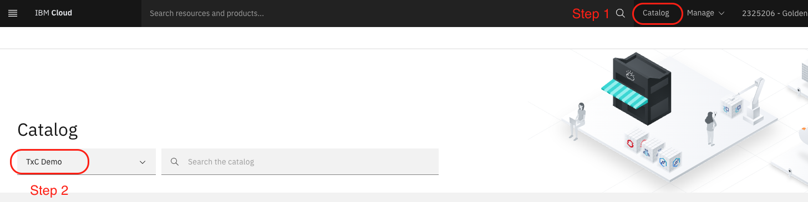
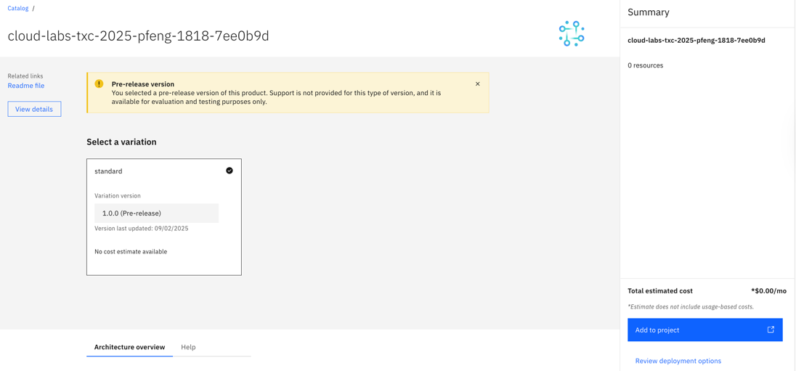
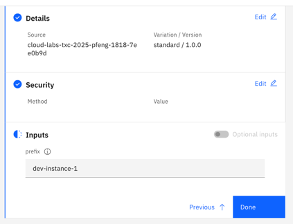

# 🌍 Consuming the DA: Multi-Environment Deployment

Now, you will switch roles from a platform engineer to a developer. Your goal is to use the Deployable Architecture (DA) that you previously published to deploy a new, complete environment from the IBM Cloud catalog.

This part of the lab demonstrates the value of platform engineering: enabling developers to quickly and safely provision complex, enterprise-grade infrastructure through a simple, self-service interface.

## Step 1: Find the Deployable Architecture in the Catalog

As a developer, the first step is to find the architecture you need in the IBM Cloud catalog.

1.  Navigate to the **Catalog** in the IBM Cloud console.
2.  On the left-hand side, under **Filter by**, select the name of the private catalog you created earlier (e.g., `My Deployable Architectures`).
3.  You should see your Deployable Architecture. Click on it.

## Step 2: Create a Project and Add the DA

A **Project** in IBM Cloud is a way to group and manage related resources and deployments. You will create a new project for your environment.

1. From the DA's catalog page, click **Add to project**.
2. Give your project a name, such as `development-environment`.
3. The **Configuration name** will be pre-filled. This is just a name for this specific deployment within the project.
4. Select the **Region** (e.g. `Dallas(us-south)`) and the **Resource Group** (e.g. `Default`).  
5. Click **Create**.

You will be taken to the project's configuration page.

## Step 3: Configure and Deploy the Architecture

This is where the self-service magic happens. The developer doesn't need to write any Terraform code; they just need to provide values for the input variables that the platform engineer exposed.

1. **Review the Configuration**:
    You will land on the **Configurations** tab of your new project. You can see the DA you added.
2. **Security tab**: Provide IBM Cloud API Key. For this tutorial, leave compliance as is. The `ibmcloud_api_key` is handled automatically and securely by the project.

3. **Provide Input Values**:
    *   Click on your configuration to open the deployment panel.
    *   You will be prompted to provide a value for the `prefix` variable. Enter a unique prefix for this new environment, for example, `dev-instance-1`.

    

4. **Save and Validate**:
    *   Click **Save**.
    *   The project will now show you the changes that will be made (i.e., all the resources that will be created).
    *   Click **Validate**. This will run a `terraform plan` in the background to ensure everything is correct.

5. **Deploy**:
    *   Once the validation is successful, click **Deploy**.
    *   The project will now run `terraform apply`, and you can monitor the progress from the **Activity** tab.

The deployment will take 10-15 minutes. Once it's complete, a brand new, fully configured hub-and-spoke environment will be running in your account.

## Step 4: Verify the New Environment

You can now go to the [Resource list](https://cloud.ibm.com/resources) in your IBM Cloud account. Filter by the prefix you just used (e.g., `dev-instance-1`), and you will see all the newly created resources: VPCs, subnets, VSIs, load balancers, etc.

You have successfully consumed a Deployable Architecture, demonstrating how platform engineering can accelerate development and ensure consistency and security across an organization.

---

[Next: Final Review and Cleanup](./08-final-review-cleanup.md)