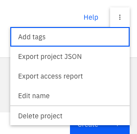

# ✅ Final Review and Cleanup

You have now completed the entire platform engineering lifecycle: from designing and automating a secure architecture to packaging it for others to consume.

## What You Accomplished

Let's review the key milestones you achieved in this lab:

-   **Designed a Secure Architecture**: You implemented a hub-and-spoke network topology, a best practice for isolating environments and securing workloads.
-   **Automated with Terraform**: You used Terraform and enterprise-grade IBM Cloud modules to define the entire infrastructure as code.
-   **Provisioned and Tested**: You deployed the infrastructure and ran a series of tests to validate connectivity, security, and the end-to-end application flow.
-   **Packaged for Self-Service**: You packaged your Terraform code into a Deployable Architecture and published it to a private catalog.
-   **Enabled Developer Self-Service**: You experienced how a developer can consume the DA to deploy a complex environment with just a few clicks, abstracting away the underlying complexity.

This lab demonstrated how platform engineering bridges the gap between infrastructure complexity and the need for development agility, resulting in faster, more secure, and more consistent application deployments.

## Clean Up Your Resources

To avoid incurring further costs, it's important to destroy all the resources you created.

### If You Deployed from the IBM Cloud Catalog (Using a Project)

The easiest way to clean up is to delete the project. This will automatically destroy all the resources that were deployed as part of that project.

1.  Navigate to **Projects** in the IBM Cloud console.
2.  Find the project you created (e.g., `development-environment`).
3.  Click the three-dots menu (**...**) at the end of the row and select **Delete**.
4.  You will be asked to confirm the deletion. This will trigger a `terraform destroy` command in the background.



### If You Deployed from Your Local Machine (Using `terraform apply`)

If you deployed the infrastructure directly from your terminal, you can destroy it from there as well.

1.  Open your terminal and navigate to the root of the project directory.
2.  Make sure your `TF_VAR_ibmcloud_api_key` and `TF_VAR_prefix` environment variables are still set.
3.  Run the `terraform destroy` command:

    ```bash
    terraform destroy
    ```

4.  Terraform will show you a plan of all the resources that will be destroyed. Type `yes` to confirm.

The cleanup process will take several minutes. Once it's complete, all the infrastructure you created during this lab will be removed from your account.

---

[Next: Conclusion and Next Steps](./09-conclusion.md)