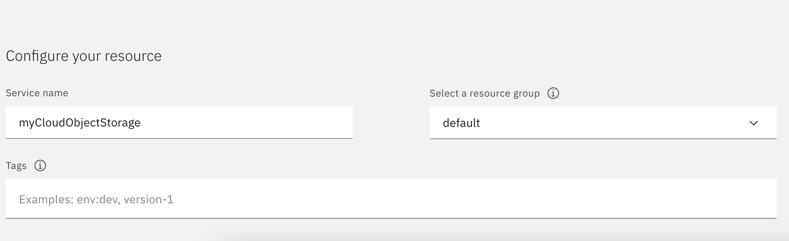

## Create a RHEL AI Image on IBM Cloud

### 1. Download the RHEL AI image

The Red Hat Enterprise AI (RHEL AI) image can be imported as a bring your own license (BYOL) from RedHat. It is available as a qcow2 image.

To download the RHEL AI image, go to https://developers.redhat.com/products/rhel-ai/download. 


### 2. Create a COS instance in your IBM Cloud account

Go to the **Catalog** and search for **Object Storage**


<p>&nbsp;</p>

Select the **Standard** plan


<p>&nbsp;</p>

Provide the **Service name** and click on **Create**




<p>&nbsp;</p>

Cloud Object Storage instance will be created


<p>&nbsp;</p>


### 3. Create a COS bucket

Create a custom bucket by clicking on **Create bucket** and choosing **Create a Custom Bucket**


### 4. Upload the rhel ai qcow2 image to the COS bucket

Click on **Upload** to upload the qcow2 image


<p>&nbsp;</p>

### 5. Add access to COS for the Image creation service. 

```
ibmcloud iam authorization-policy-create is cloud-object-storage Reader  --source-service-account <Account ID> --source-resource-type image
```

<p>&nbsp;</p>

### 6. Create a VPC image from the downloaded qcow2 image

Click on **VPC Infrastructure -> Images**  and click on **Create**.


