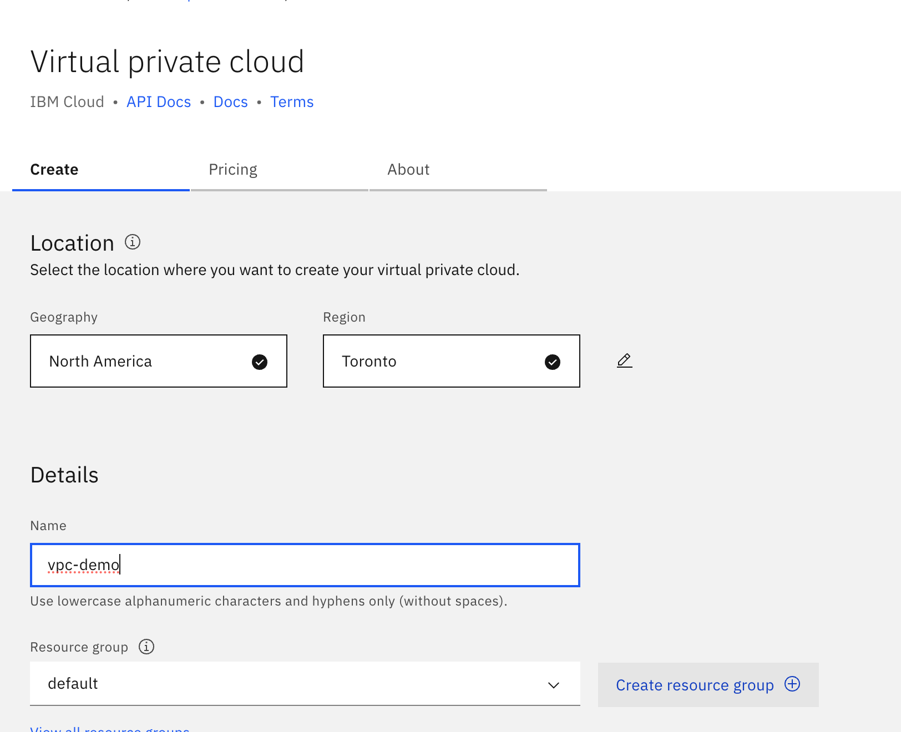
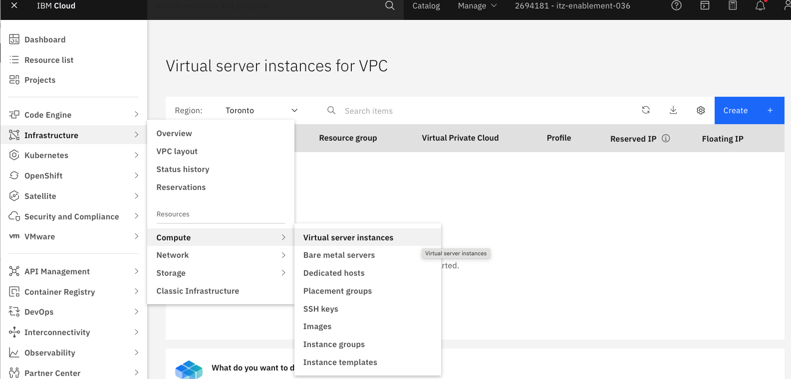
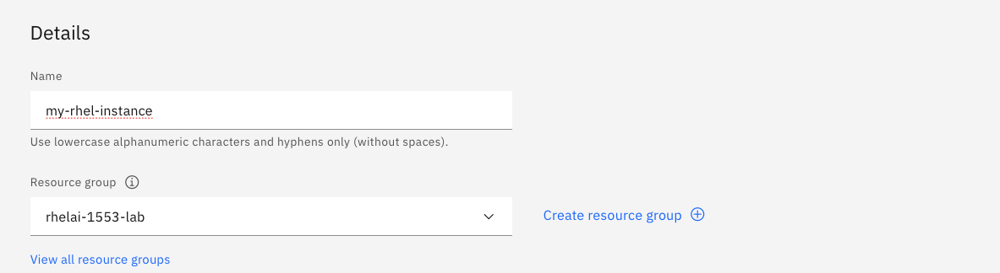

## Deploy the RHEL AI image on IBM Cloud

### 1. Create a VPC

Go to **Infrastructure -> Network-> VPCs**. Provide the name and take the defaults. Click **Create** to create a  virtual private cloud

&nbsp;

### 2. Create a RHEL AI instance

Go to **Infrastructure -> Compute -> Virtual server instances**. 

Click on **Create**. 

Provide the **Name**. Choose the **Resource group**

&nbsp;

Choose the custom image for RHEL AI in the **Image** section by clicking on the **Change image**

&nbsp;

Choose the Instance Profile (GPU) in the **Profile** section by clicking on **Change profile**

Choose the gx3-48x240x2l40s profile.

&nbsp;

Select / Create the ssh key and store the private key.

&nbsp;

Increase the size of the boot volume to **250G** by clicking on the **edit pencil**

&nbsp;

Click **Create virtual server**

&nbsp;

### 3. See the Virtual server instance
Go to **Infrastructure -> Compute --> Virtual server instances**

&nbsp;

### 4. Set up a floating IP 
Click on the Virtual server instance and go into the **Networking** tab. Click on the **...** and click on **Edit floating IPs** 

Click on **Attach and Reserve new floating IP** to create a Floating IP and attach it to the server.

The Virtual Server should show the FIP attached to it. Make note of this floating IP.

