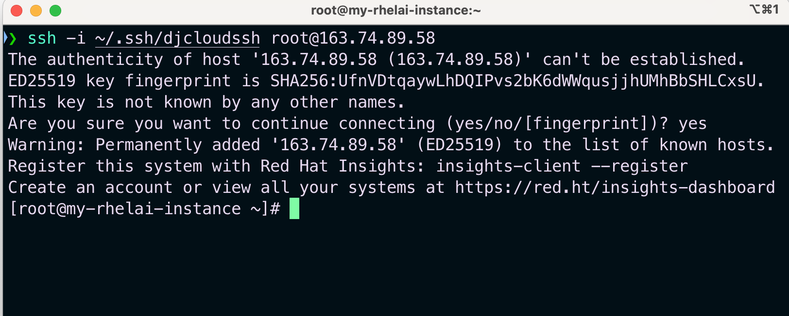
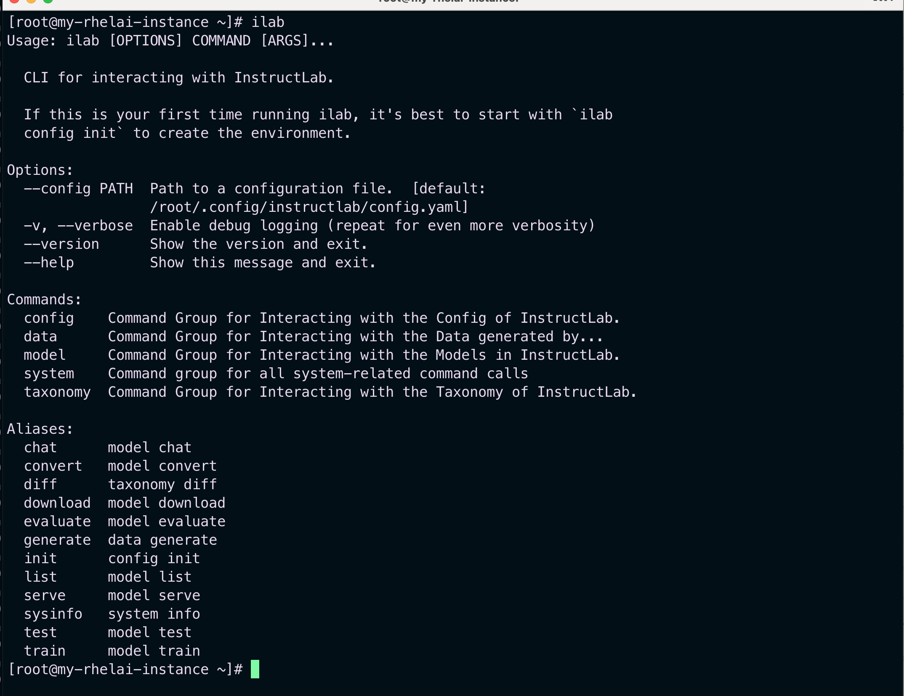
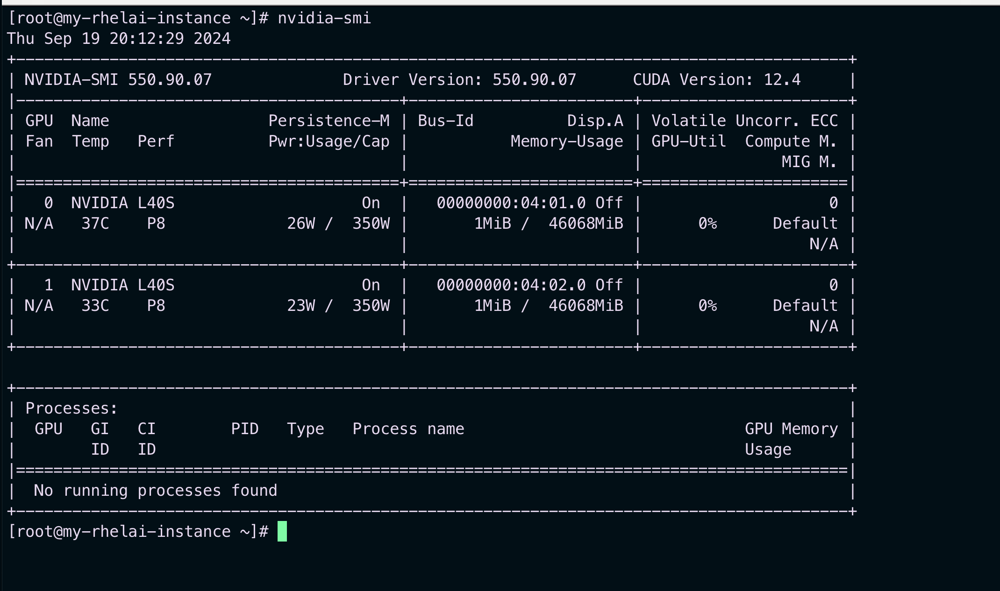

## Logon to the deployed RHEL AI instance


### 1. Logon to the RHEL AI instance

Use the Floating IP and the ssh key used to deploy the instance to logon to the RHEL AI instance

``` shell
ssh -i ~/.ssh/mysshkey root@instanceIP
```

<p>&nbsp;</p>




### 2. Run the following commands to see the VM 

``` shell
ilab

```

<p>&nbsp;</p>



``` shell
nvidia-smi
```


<p>&nbsp;</p>



