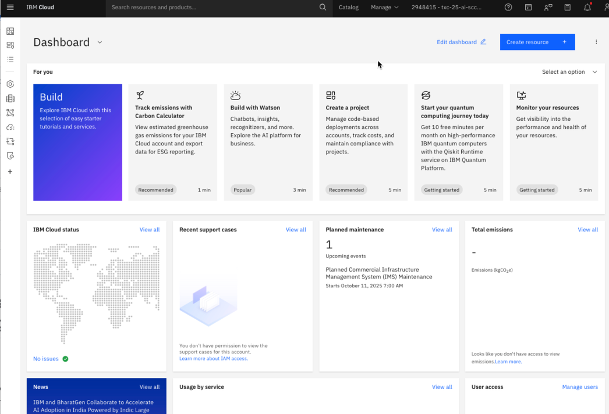

## Getting Started

### Log in to IBM Cloud and launch SCC+WP

1. Go to https://ibm.biz/txc-1833

2. Enter the `Username` and `Password` provided for the lab

3. Click on the `Sign in` button

You will be placed on the IBM Cloud dashboard screen

4. To view the resources, click the menu icon  on the top left part of the screen.

Then select “Resource list” to see the list of resources.

 

5. In the resources list, in the Security category, find the instance of Security and Compliance Center Workload Protection - "SCC-WP-Instance"

Click the name on the left-hand side of the instance to continue.
   

6. On the SCC+WP instance screen, launch SCC+WP instance UI by clicking the “Open dashboard” button on the top right
 

You should now see the Home page of SCC WP.

The Home page provides a summarized view of the vulnerabilities and compliance posture of the resources in the account. We will explore these further in the exercises.

How is the vulnerability and compliance information collected? 

Workload Protection agents routinely scan the resources in the IBM Cloud account and feed into the SCC+WP instance. The agents are installed by account administrators. For the purpose of this lab they are already installed.

7. To check the details of the installed agents, click on “Integrations” > “Sysdig Agents” in the bottom left menu.

8. Check the status of the agents. 

You should see 5 agents connected and up-to-date. This confirms SCC+WP is configured and collecting data about compliance checks on the resources in the account.
