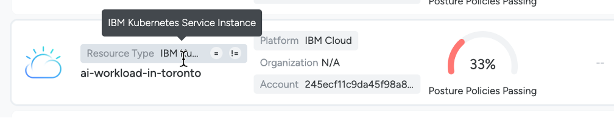

## Inventory

### Exercise: Find resources that fail compliance with policy controls

We will now look at the inventory of resources and find resources that fail compliance with policy controls.

1. Navigate to “Inventory” > “Resources”.

 
You should now see a full inventory of resources. In the following steps you will filter on specific resources and find the policy and controls that are failing. 

2. Expand the featured filter option. In Platform category, select IBM Cloud “in” – i.e., show resources “in” the - IBM Cloud platform.

Apply additional filters to narrow down on resources of specific type of category. 

In the Compute category, select “in” - i.e, show the compute resources.

 

You will notice two compute resources are failing policy – “IBM Kubernetes Service Instance” and “IBM Virtual Server for VPC Instance”

 
3. Click on the “IBM Kubernetes Service Instance” and select “Configuration Findings”. 

Check “Failing Policies” and “Failing Controls”. 

This instance is failing certain compliance policies. The specific controls it fails shows that this resource can be accessed via external endpoint. To remediate the administrator must check whether it can be accessed only through a private endpoint.

Close the tabs.

5. Select the other failing resource – “IBM Virtual Server for VPC Instance” and select “Configuration Findings”.
 

 
Check “Failing Policies” and “Failing Controls”. 

This instance is failing certain compliance policies – including the AI Security Guardrails policy and multiple controls. 

Check the specific controls. It appears the virtual server was not provisioned using a customer-defined list of images – i.e., it was provisioned from an unapproved image that may contain vulnerabilities and create risks. To remediate the administrator must ensure the server is using an approved image. It also failed a control where the virtual server has an attached floating (public) IP address, i.e., the virtual server is exposed and accessible externally. The administrator must remove the floating (public) IP address and have the ai-workload accessible only through private IP address endpoints.

