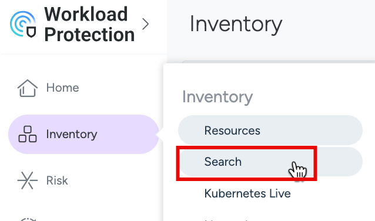
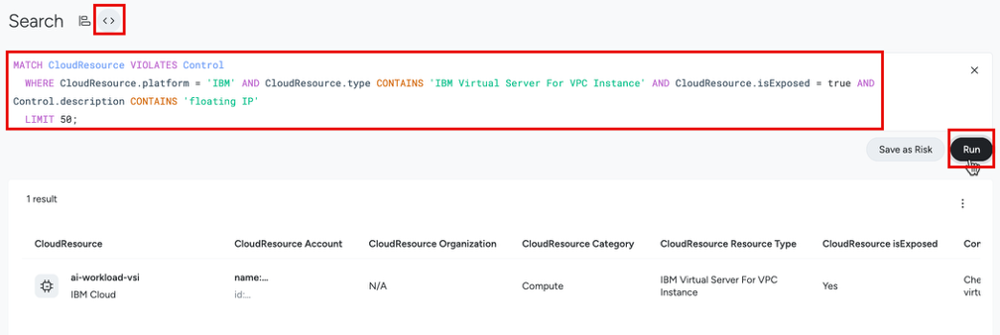
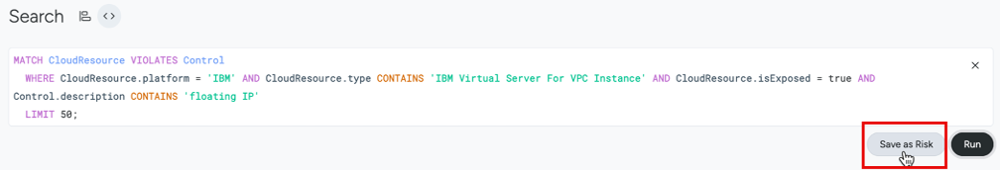
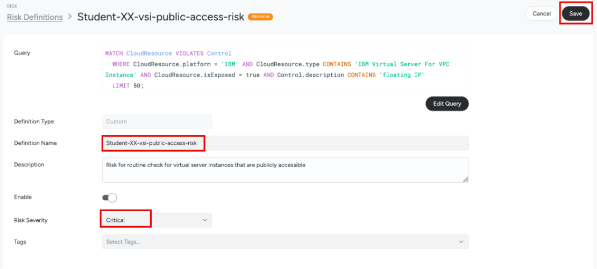
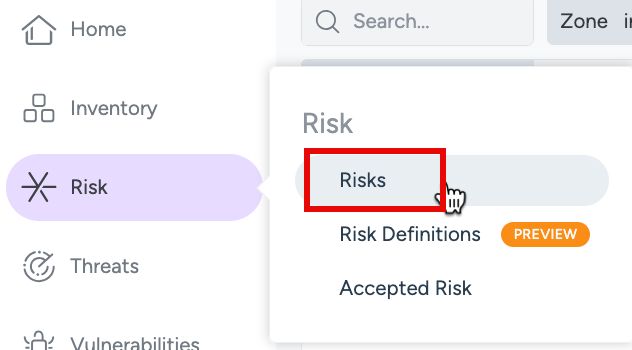
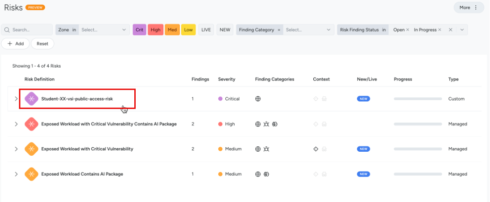
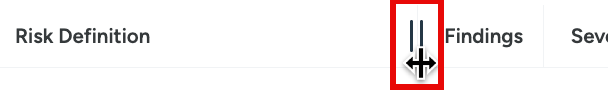
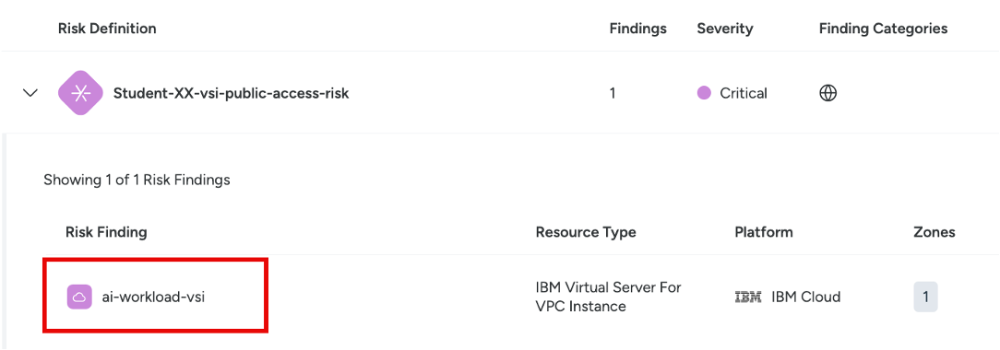
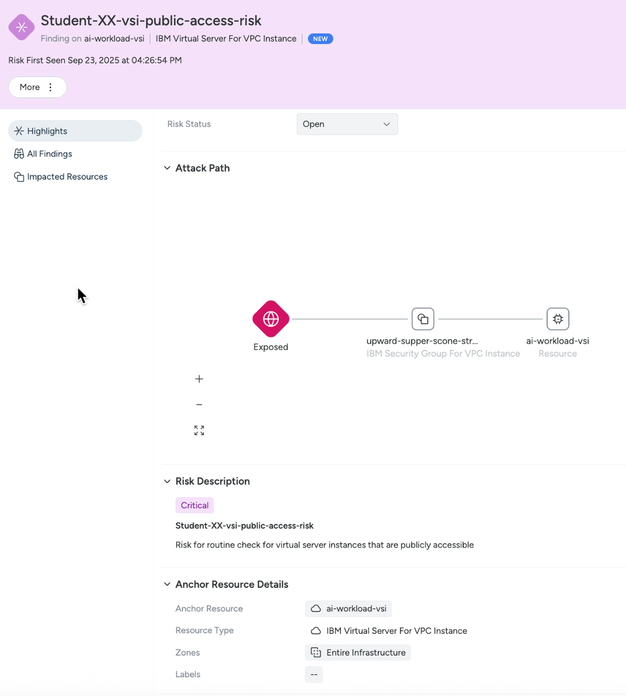

## Unified Risk Findings

### Exercise: Configure risk findings

In the previous exercise we identified a virtual server instance that failed policy controls and posed risk. In a real-world system we want to routinely check the account for such risks.

The “Risks” feature in SCC Workload Protection unifies risk with real-time security events and runtime insights for cloud infrastructure. It consolidates findings from runtime events, vulnerabilities, posture and identity. It also adds context through attack path analysis and prioritization, and enables users to quickly visualize and gain context about immediate risks.

Risks are regularly re-evaluated and reprioritized based on the latest SCC Workload Protection findings. This ensures that users have an evolving assessment of their current risk factors enriched with runtime context and detections. 

We will create a custom risk that triggers when any IBM Cloud virtual server instance (VSI) resource fails control due to being publicly exposed.

1. First, we will manually create and run a query to find and list these exposed VSI resources.

Go to “Inventory” > “Search” 



Select the “<>” icon.  In the search, enter the query below.

```
MATCH CloudResource VIOLATES Control WHERE CloudResource.platform = 'IBM' AND CloudResource.type CONTAINS 'IBM Virtual Server For VPC Instance' AND CloudResource.isExposed = true AND Control.description CONTAINS 'floating IP'  LIMIT 50;
```

This query will find all the IBM Cloud Virtual Server for VPC instances with the "Check whether virtual servers for VPC instance doesn't have a floating IP" control failing, that are exposed. 

Click “Run” to see the list of virtual servers that are externally exposed.




2. Since we don't want to run this query manually every day, we can now save it as a custom risk definition. 

Click on the "Save as a Risk” button.



Give it a name that can identify your custom risk. 

For example `Student-XX-vsi-public-access-risk` where `XX` is your student number. 

Assign a severity of your choice.


 
Now, click on “Save” to create your custom risk.

3. Go to the “Risk” > “Risks” section to check the custom risks.



Here, you can see a list of risks -  the one you created, the ones created by other students, and other pre-existing risks.

_Note: You might need to wait 2-5 minutes for your custom risk to show up._
_In the meantime you can continue the exercise by clicking the pre-created "Student-XX-vsi-public-access-risk" custom risk._
_You may also need to click on the "load more" as there will be more than 10 risks._



To see the full text, you can resize the Risk Definition column.




4. Open the occurrence of the Risk Definition you created 



Click on the impacted resource and review the findings.




 


