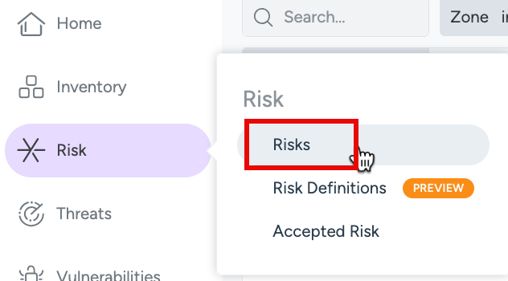
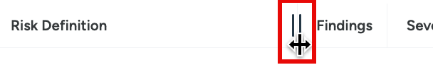
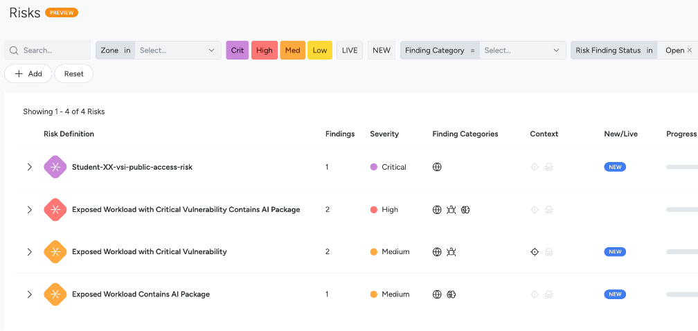
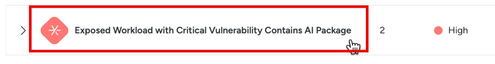
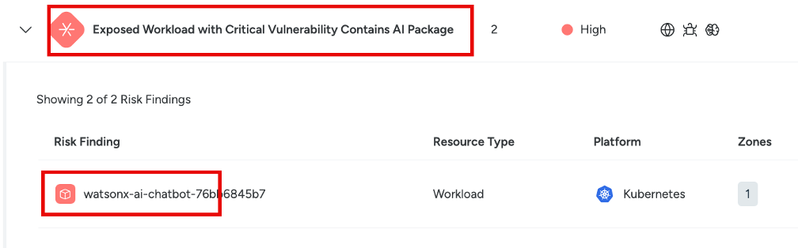
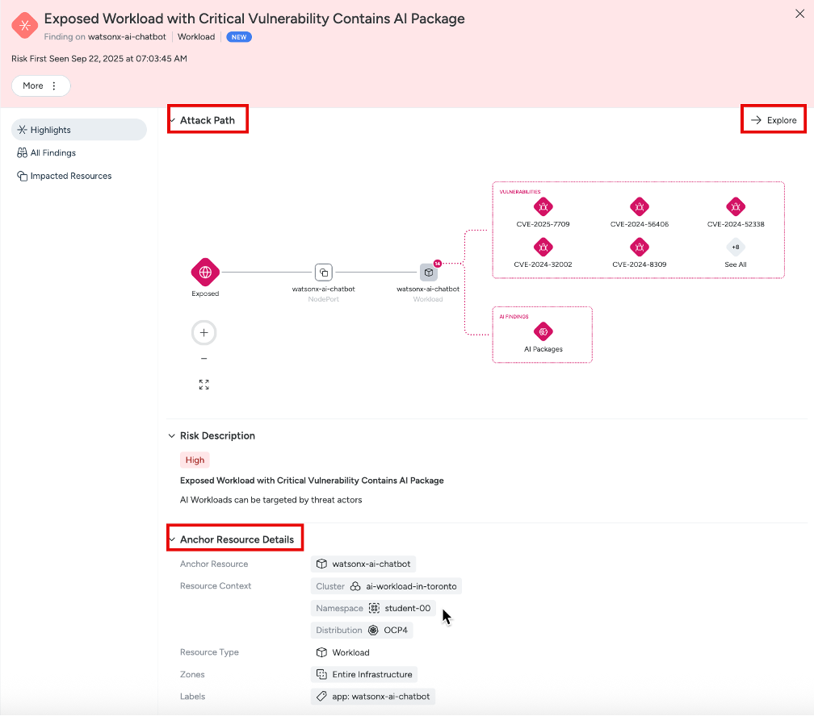
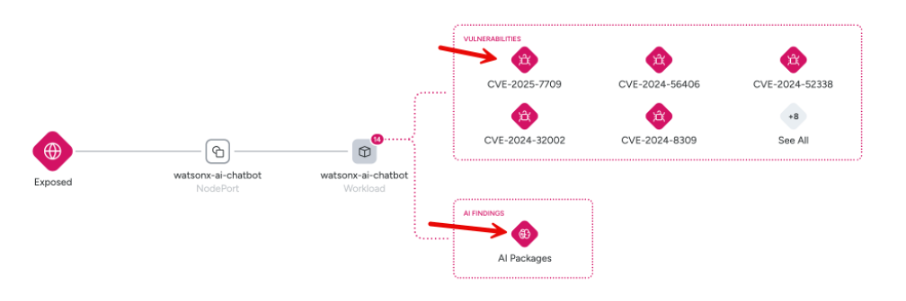
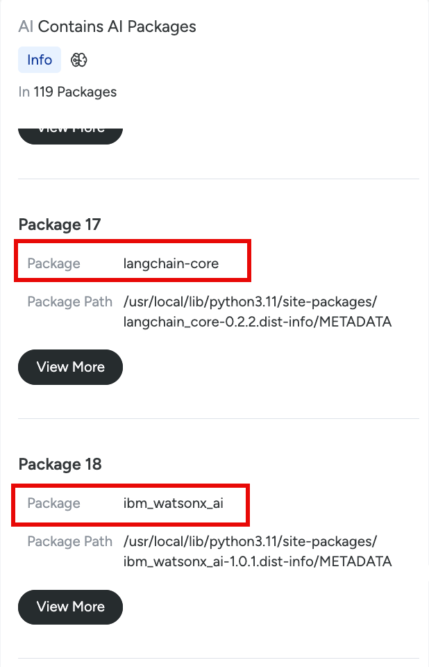
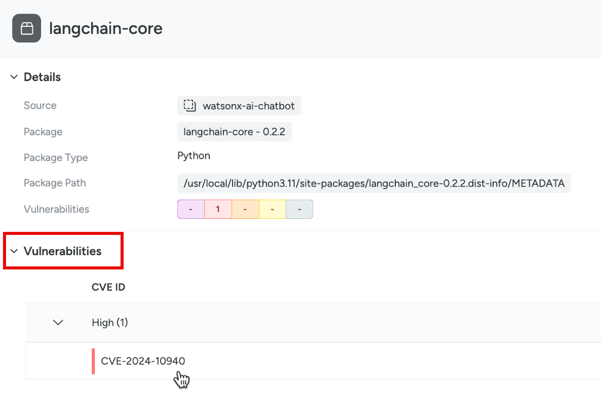
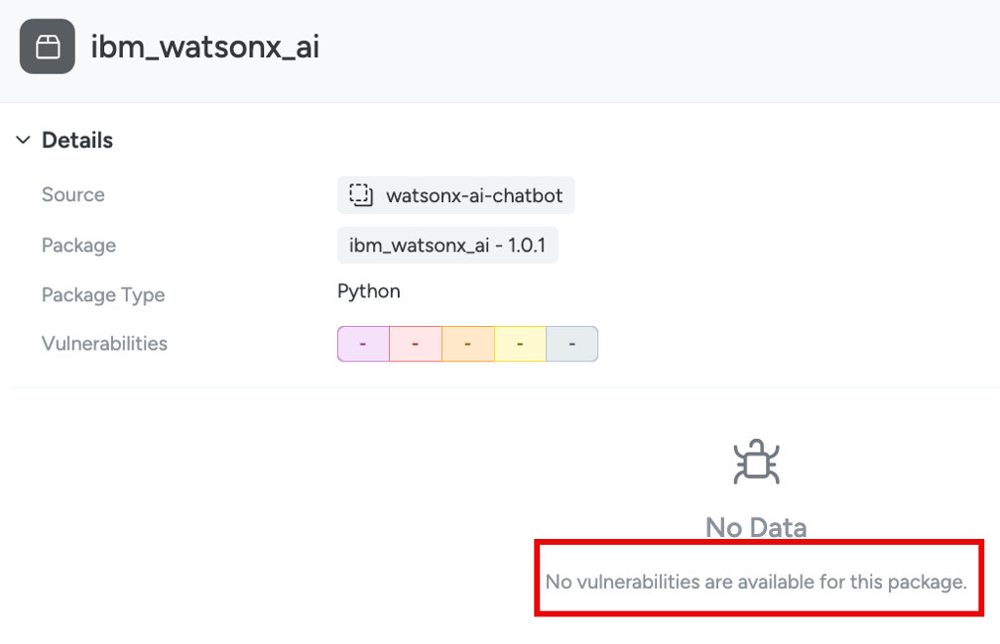

## AI Packages

### Exercise: Exposed Workload Contains AI Package
For our lab, the Red Hat OpenShift cluster has an unsanctioned and exposed “shadow AI” deployment of an AI application. Can you find it?

In this exercise we will discover if we have any AI workloads with exposed risks. You will also need to answer the following questions as part of this exercise:

- What is the exposed AI workload?
- In what part of your infrastructure is this workload running?
- Can you list the AI packages that are in an exposed workload?
- Which package has vulnerabilities of this AI workload?

1. Navigate to the “Risks” section.

 
Resize the “Risk Definition” column so that full text is visible.

 
You should see multiple risks listed, some were created in the previous exercise. In this exercise we are interested in pre-configured risks about AI.

 
2. Click on the "Exposed Workload with Critical Vulnerability Contains AI Package" risk definition to check its findings. This is a risk that finds workloads that contain AI package and have critical vulnerability.
 

You can see the “watsonx-ai-chatbot” AI workload found by this risk. 

Click on the finding to get more details. Review the “Attack Path” and “Anchor Resource Details”.

In the “Attack Path” section, click “Explore” to see more details on vulnerabilities and AI packages.

 
3. In the “Vulnerabilities” group, click on individual CVE – vulnerabilities to find more details about the vulnerabilities in the resource.

4. In the “AI Findings” group, click on “AI Packages” to find the AI packages found for this workload. 

Scroll through the list of packages. Some common package names may be repeated due to their multiple occurence in the workload code. You should be able to find “langchain-core” and “ibm_watsonx_ai”

 
Click on “View More” for the langchain-core and ibm_watsonx_ai packages. Check which AI package has vulnerabilities (CVEs) and is part of this risk finding.
 

