## Compliance and Posture Management

### Exercise: Compliance Posture with AI Security Guardrails 2.0 Policy

SCC Workload Protection provides posture management policies that automate compliance checks for many government and industry standards and best practices. A list can be found [here](https://cloud.ibm.com/docs/workload-protection?topic=workload-protection-about#about-available-policies). 

In this exercise, you will use the policy “AI Security Guardrails 2.0” to build a deeper understanding of compliance and posture management. This policy provides a list of controls for the full stack including AI applications, models, data, and infrastructure layers required to handle AI and generative AI workloads.

You need to answer the following questions as part of this exercise:
- How many requirements are part of this policy?
- How many technical controls are applied to the requirement group “Data Privacy & Confidentiality”
- Review the results of this policy and answer:
  - How many requirements are failing vs passing?
  - Is there any requirement with some controls passing but others failing? In this case, is the requirement considered passed or failed?

1. To review all details of the policy, navigate to Policies > Posture > Policies.

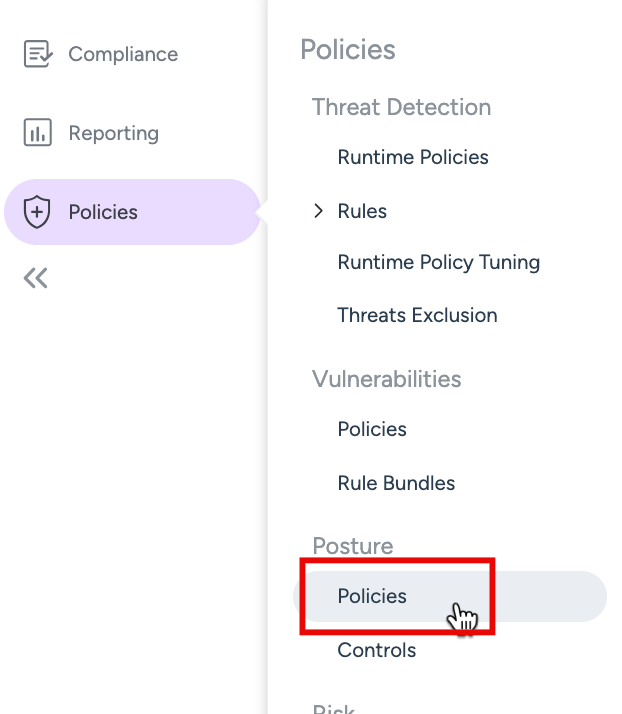

You will see a list of available policies.

Click on "AI Security Guardrails 2.0"

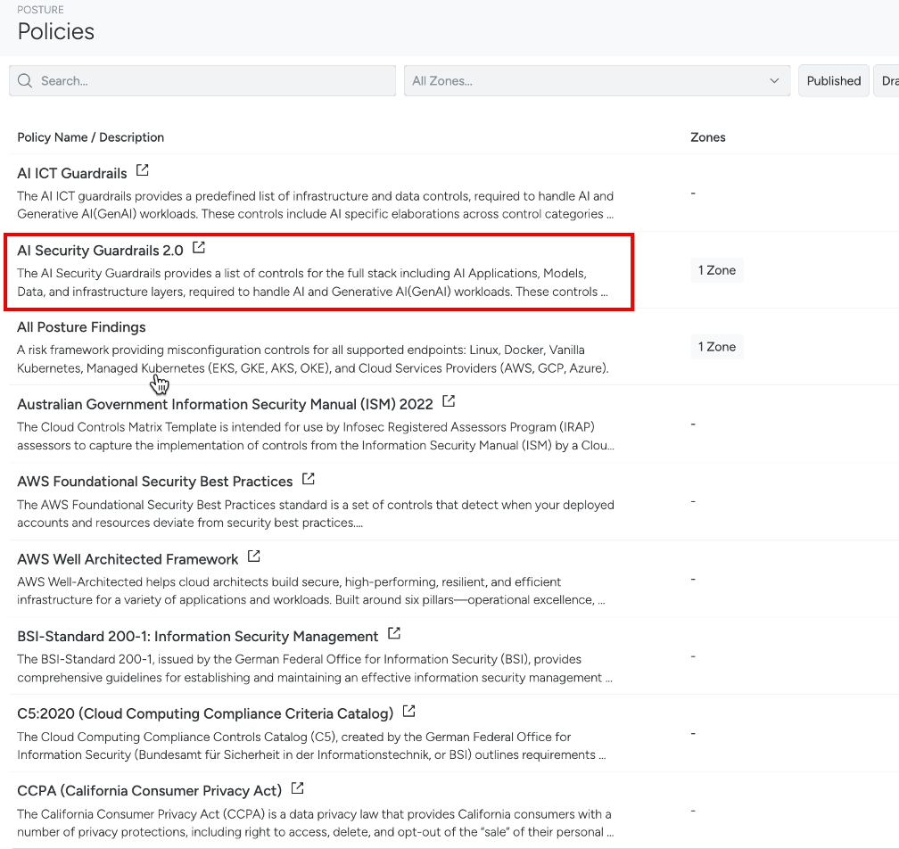

Select the tab “Requirements and Controls”. 

A grouped list of requirements and controls for this policy is shown. This policy has in total 578 controls. 

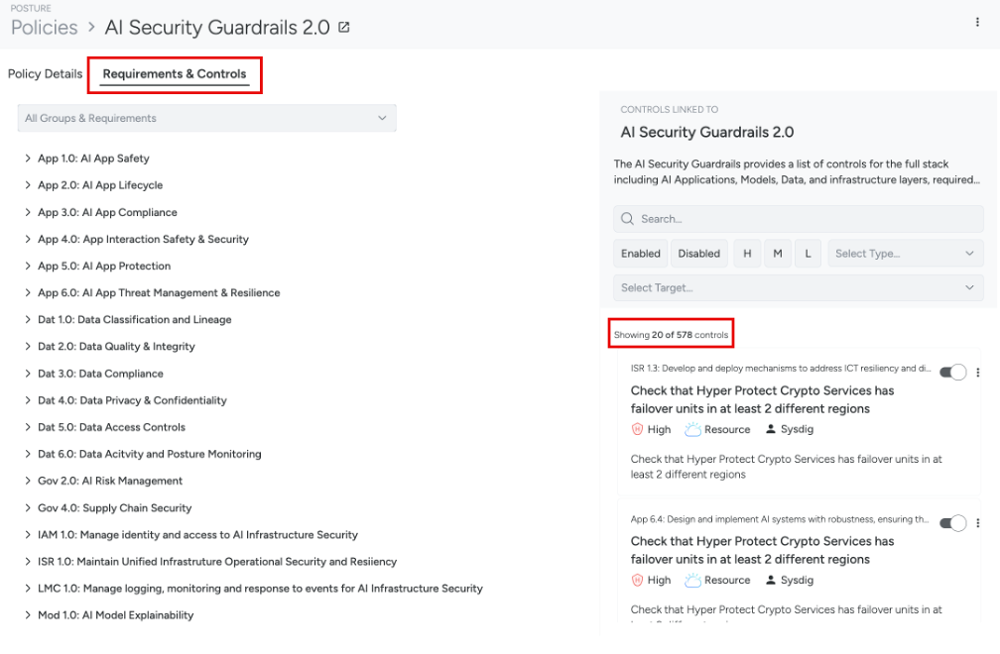

By selecting a certain Group and Requirement, you can see the technical controls applicable to that requirement group.  

2. Select the “Dat 4.0: Data Privacy & Confidentiality” group. It shows that it has 79 controls.

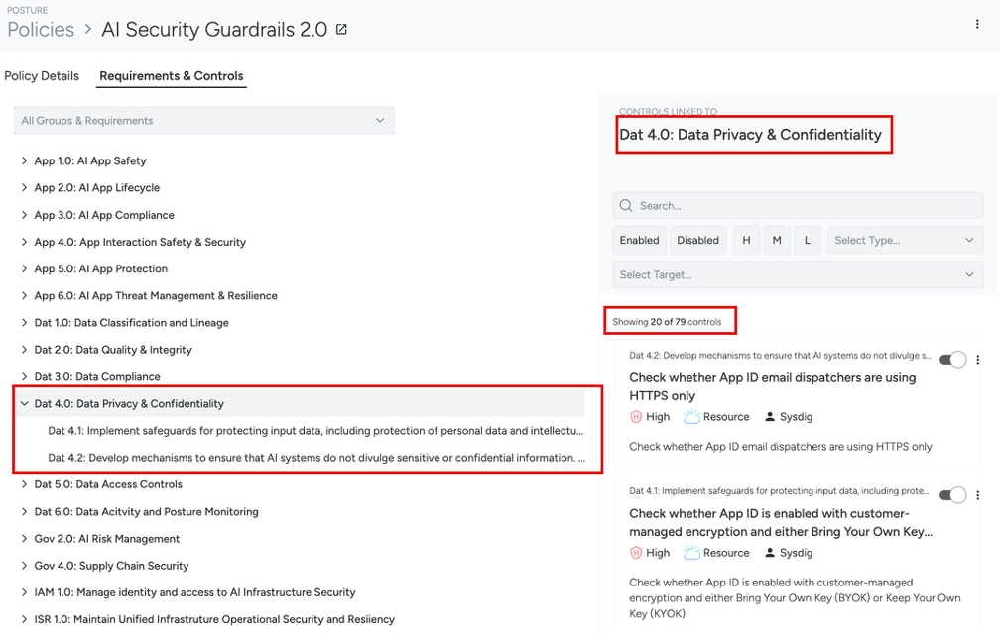

The resources are routinely scanned to check compliance for this policy. The results of these routine scans can be checked under Compliance. 

3. Navigate to Compliance > Overview. 

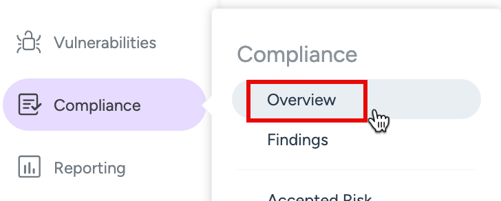

Select  "AI Security Guardrails 2.0 Results" to see the findings for this policy.

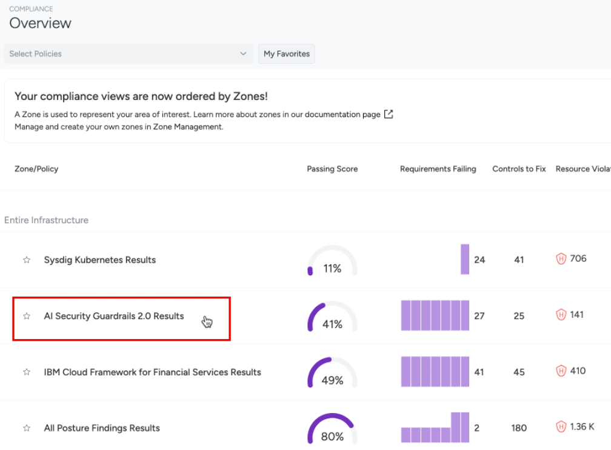

In the results shown in example below, 27 requirements are failing and 19 passing. In the column “Controls Failed”, you can see the total technical controls per group and requirement and see how many are passing / failing. For instance, 11/37 means that 11 are failing from 37 total controls. A requirement would get "pass" only in the case all its technical controls are passing correctly. 

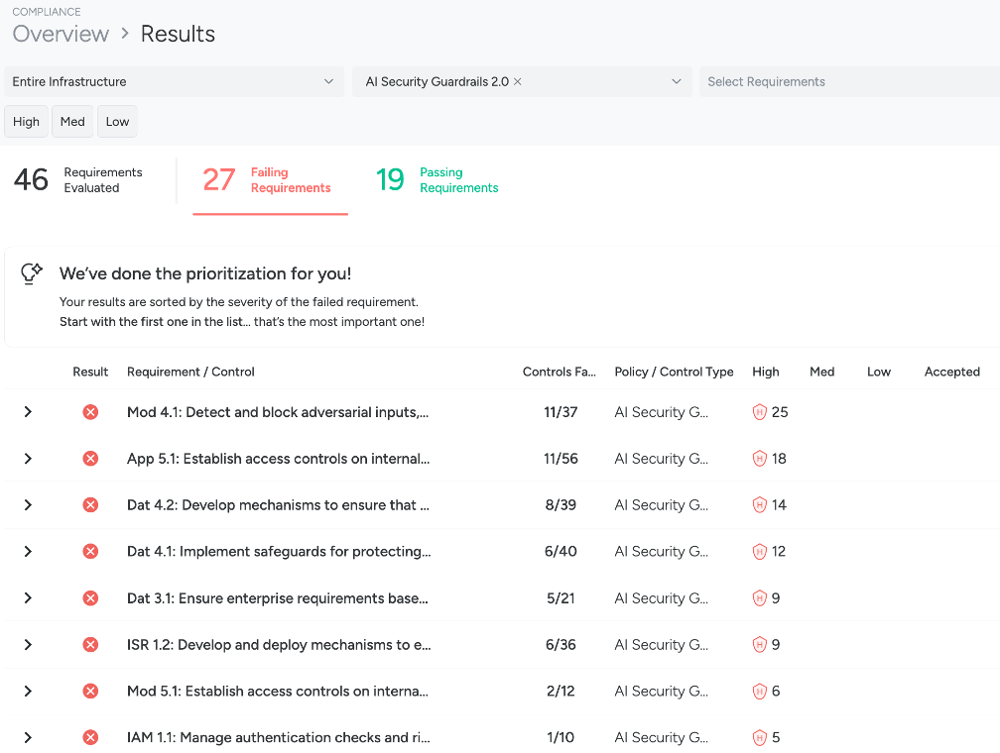

Remember the "ai-workload-vsi" virtual server risk identified in the inventory exercises? It was a control from this policy that had identified the server resource as a risk and marked the control as failed. We will find that contorl here.

4. Select/expand the "Mod 4.1 Detect and block adversarial inputs..." control requirement.

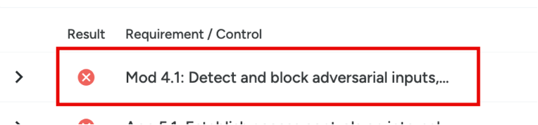

Scroll and find the the specifc control "Check whether virtual server for VPC instance...". Click it to see results for this control check.

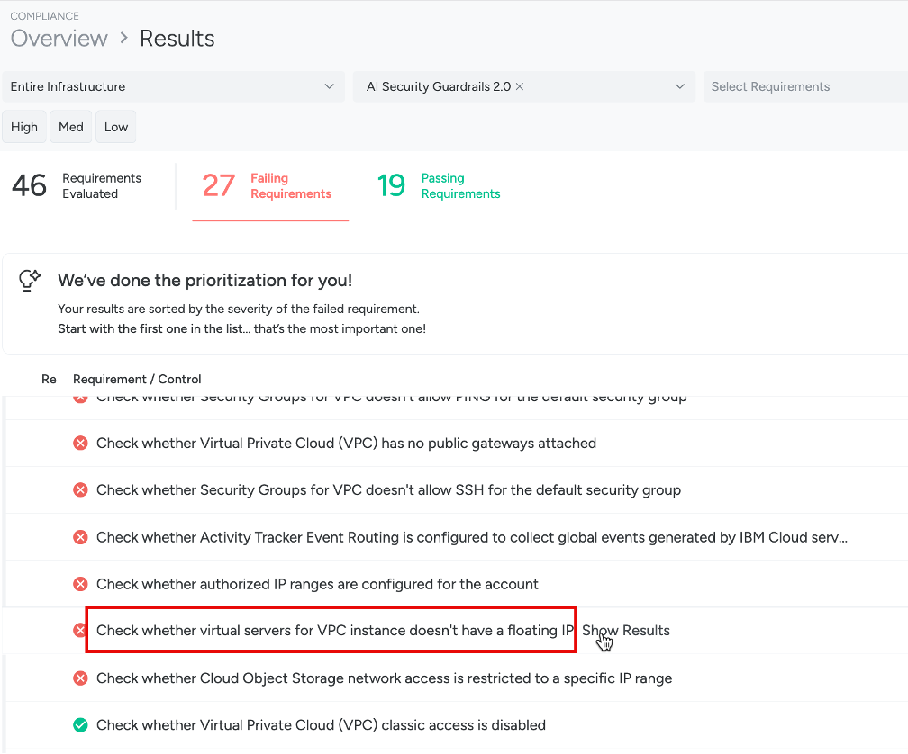

Click on the identified resource "ai-workload-vsi" and review more details and remediation.

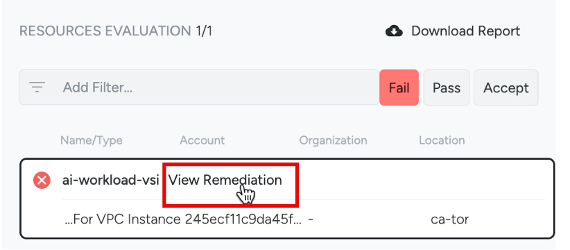

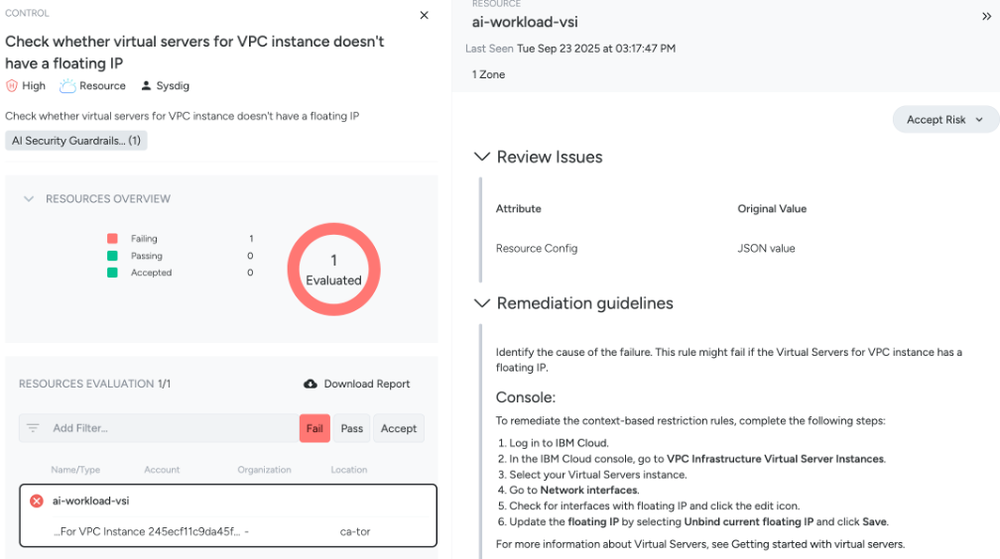
 

 
